# HTML and CSS Notes

## HTML tags

| tag                              | description                      |
| -------------------------------- | -------------------------------- |
| `<doctype html>`                 | Information                      |
| `<html>`                         |                                  |
| `<head>`                         |                                  |
| `<body>`                         |                                  |
| `<title>`                        |                                  |
| `<header>`                       |                                  |
| `<h1>`                           |                                  |
| `<h2>`                           |                                  |
| `<h3>`                           |                                  |
| `<h4>`                           |                                  |
| `<h5>`                           |                                  |
| `<h6>`                           |                                  |
| `<nav>`                          |                                  |
| `<a href="mypage.html">link</a>` |                                  |
| `<article>`                      |                                  |
| ``         |                                  |
| `<p>`                            |                                  |
| `<strong>`                       |                                  |
| `<b>`                            |                                  |
| `<em>`                           |                                  |
| `<ol>`                           | numbered list                    |
| `<ul>`                           | bullet list                      |
| `<li>`                           | bullet (inside `<ul>` or `<ol>`) |
| `<footer>`                       |                                  |
| `<aside>`                        |                                  |
| `<button>`                       |                                  |
| `<style>`                        | css                              |
| `footer`                         |                                  |
| `<span>`                         |                                  |
| `<blockquote>`                   |                                  |
| `<em>`                           |                                  |
| `<nav>`                          |                                  |
| `<main>`                         |                                  |
| `<section>`                      |                                  |
| `<menu>`                         |                                  |
| `<aside>`                        |                                  |

## CSS tags

| tag                          | description                                    |
| ---------------------------- | ---------------------------------------------- |
| `font-size`                  | size of font e.g. 20px                         |
| `font-family`                | font e.g. `sans-serif`                         |
| `text-transform`             | lowercase, uppercase etc.                      |
| `font-style`                 | italic, bold, etc                              |
| `text-align`                 | left, center, right, etc                       |
| `line-height`                | spacing between lines e.g for `<p>`            |
| `list-style`                 | square, circle, number                         |
| `background-color`           | background color for area                      |
| `border`                     | border                                         |
| `border-top`                 | top border                                     |
| `border-bottom`              | bottom border                                  |
| `border: 5px solid black`    | 5px solid black border                         |
| `* {}`                       | whole document                                 |
| `body {}`                    | whole body tag                                 |
| `margin`                     | sets margin area on all four sides of element  |
| `margin: 1px 2px`            | vertical-horizontal margin                     |
| `margin: 1px 2px 3px`        | top-horizontal-bottom margin                   |
| `margin: 1px 2px 3px 4px`    | top-right-botton-left margin                   |
| `margin-bottom: 1px`         | botton margin                                  |
| `margin-left: 1px`           | left margin                                    |
| `margin-top: 1px`            | top margin                                     |
| `margin-right: 1px`          | right margin                                   |
| `text-align:`                | alignement of text                             |
| `text-transform:`            | e.g. `uppercase` or `lowercase`                |
| `padding:`                   | sets padding area - four sides of element      |
| `font-weight:`               | e.g. `bold`                                    |
| `text-decoration`            | e.g. `underline`, `none`. used with links      |
| `cursor:`                    | sets the mouse cursor at hoover                |
| `<a hre... class="x">x</a>`  | please see below - css and links               |
| `.x:hover {}`                | style at hoover in class `x`                   |
| `.x:active {}`               | style at link click                            |
| `.x:link {}`                 | link style                                     |
| `.x:visited {}`              | link style when visited                        |
| `<ul class="list">`          | see blow for styling                           |
| `.list{list-style: square;}` | squared bullets in list                        |
| `.list li {}`                | styling of each bullet e.g. `margin-left:`     |
| `if <p id="test">`           | use then `#test {}`                            |
| `if <p>`                     | use then `p {}`                                |
| `if <p class="test">`        | use then `.test{}`                             |
| `position:`                  | e.g. `absolute`, `relative`                    |
| `.x{position: relative}`     | offset relative to itself (see: pos below)     |
| `.x{position: absolute}`     | remove from normal flow of doc (pos below)     |
| `width`                      | sets an elements width                         |
| `li:first-child {}`          | first bullet                                   |
| `li:last-child {}`           | last bullet                                    |
| `li:nth-child(even)`         | even numbered bullets                          |
| `display:`                   | e.g. `inline`,`inline-block`,`block` see displ |
| `a:link {}`                  | style for links in `<a>` tags                  |
| `a:hover {}`                 | style for links in `<a>` when hoovered         |
| `a:active {}`                | style for links in `<a>` when clicked          |
| `nav a:link {}`              | style for links in `<a>` which in a `<nav>`    |
| `nav a:link:last-child {}`   | last link in `<a>` -> `<navb>`                 |
| `button {}`                  | design for a `<button>` tag.                   |
| `h3 + p {}`                  | style `<p>` directly after `h3` (see: op)      |
| `h3 + p::first-line {}`      | style first line of the paragraph after `<h3>` |
| `h1::first-letter {}`        | style the first letter in `<h1>`               |
| `element::after {}`          | see ::after and ::before                       |
| `element::before {}`         | see `::after` and `::before`                   |
| `float:`                     | let the element float e.g. `float: left;`      |
| `clear:`                     | clear the float                                |
| `clear: both`                | Clears float on both sides                     |
| `box-sizing:`                | e.g. `border-box` or `content-box`             |

## What is CSS?

CSS stands for Cascading Style Sheets

## How can CSS be sources into a HTML document?

You can insert CSS code inside a HTML document in three different ways i.e.
`Inline CSS`, `Internal CSS` and `External CSS`.

### Inline CSS

`Inline CSS` means writing CSS code inside an HTML element brackets
e.g. `<h1 style="color: blue">This text is blue</h1>`. This is not recommended.

### Internal CSS

`Internal CSS` means writing CSS code inside `<style>` brackets in the HTML
document itself. The `<style>` tags needs to be in the `<head>` section i.e.

```html
<html>
  <head>
    <title>title</title>
    <style>
      h1 {
        color: blue;
      }
    </style>
  </head>
  <body>
    <h1>This text is blue</h1>
  </body>
</html>
```

### External CSS

`External CSS` means creating a external CSS file, typically named `style.css`.
This file is then sourced into the HTML code through placing following code
inside the header brackets `<link href="style.css" rel="stylesheet" />` in the HTML file.

Example of `style.css`:

```css
h1 {
  color: blue;
}
```

Sourcing this file into a HTML document will make all the text between `<h1>`
brackets blue.

## Comments in CSS

In order to enter a comment into a stylesheet, use: `/* comment */`.

## Classes, id-selectors and tags

### IDs

Specify a id in a html tag like `<p id="copyright>` or `<p id="author">` and
then use `#author {}` and `#copyright{}` in the CSS file for styling. Make sure
that there can only be 1 id per html file.

### Classes

If you want to use the styling in more than one place you need to use classes.
You can define a class in the HTML as `<p class="related-author">` and then
style it in the stylesheet through `.related-author{}`.

### Tags

- You can basically give an area a name i.e. `<header>`and then only choose to
  style it with `header {background-color: black;}` if you have similar areas of
  `<header>`, you can basically add a class to it.

- If you want to add a background color to whole document,
  just add `body {background-color: blue;}`

- You can style HTML tags in a stylesheet by providing the tag names in the
  stylesheet e.g. `h1{}`, `p {}`.

## Pseudo-classes

A CSS pseudo-class is a keyword added to a selector that specifies a special
state of the selected element(s). For example, `:hover` can be used to change a
button's color when the user's pointer hovers over it.

```css
/* Any button over which the user's pointer is hovering */
button:hover {
  color: blue;
}
```

Pseudo-classes let you apply a style to an element not only in relation to the
content of the document tree, but also in relation to external factors like the
history of the navigator (`:visited`, for example), the status of its content
(like `:checked` on certain form elements), or the position of the mouse (like
`:hover`, which lets you know if the mouse is over an element or not).

Some other examples of pseudo classes:

```css
/* first list element */
li:first-child {
  font-weight: bold;
}

/* last list element */
li:last-child {
  font-style: italic;
}

/* second list element */
li:nth-child(2) {
  color: red;
}

/* all odd list elements */
li:nth-child(odd) {
  color: black;
}
```

A very common misconception on how
pseudo classes works is following.

```html
<article>
  <header>
    <h2>the basic language of the web: html</h2>

    

    <p id="author">
      posted by <strong>laura jones</strong> on monday, june 21st 2027
    </p>
  </header>
</article>
```

Using following `CSS` code:

`article p:first-child {color:red}` will not work since `<p>` is not the first
child of `<article>`. It is header which is the first child of `<article>`. The
only way it would work is if we use `article header { color: red;}`.

More examples:

- Style first letter in `<h1>` directly from CSS:

```css
h1::first-letter {
  font-style: normal;
  margin-right: 10px;
}
```

- Style first line in all `<p>` tags:

```css
p::first-line {
  color: red;
}
```

- Style the first line in a paragraph directly after a `<h3>` tag:

```css
h3 + p::first-line {
  color: darkorchid;
}
```

- Add a cool "top box" next to a `<h2>` header:

```css
h2 {
position:relative;
}
h2::after {
content: "top";
background-color: yellow;
color:black;
font-size: 16px;
font-weight: bold;
display: inline-block;
padding: 5px 10px;
position: absolute;
top:-15px;
right: -25px;
```

## Inheritance

- If you style `<p>`, all the tags within the `<p>` tag will follow. i.e. if you
  have `<p>hey <strong>you</strong></p>` and you style `<p>`, then `<strong>`
  will inherit the style.

- Inheritance comes from parent tags e.g. style `<a> (link)` and `<p>` tags
  within a `<nav>` tag: `nav a:link, nav p { font-size: 18px; }`

  - You could also just do: `nav { font-size: 18px;}` which basically is the same if
    there is only a `<a>` and a `<p>` tag inside the `<nav>`.

- Universal selector: `* {}`, you could also use `body {}`.

## Combining selectors

Some examples below:

- You can use the same properties for many selectors at the same time e.g.,

```css
h1,
h2,
h3,
h4,
li,
p {
  font-family: sans-serif;
}
```

- Modify `<p>` tags only in the `<footer>` - use then:

```css
footer p {
  font-size: 10px;
}
```

- Same for `<p>` tags in headers:

```css
header p {
  font-style: italic;
}
```

## Conflicts between selectors

1. Should not be used: declaration marked `!important`.
2. Should not be used: inline style (style attribute in html)
3. Highest priority: id selector (last selector gets applied)
4. Class (`.`) or pseudo class (`:`) selector
5. Element selector (p, div, li, etc)
6. Universal selector

## Styling hyperlinks

An example:

```css
/* styling hyperlinks */
a:link {
  color: #1098ad;
  text-decoration: none; /* no underline on links */
}

a:visited {
  color: #1098ad; /* same color on links*/
}

a:hover {
  color: orange;
  font-weight: bold;
  text-decoration: underline dotted orangered;
}

a:active {
  background-color: black;
  font-style: italic;
}
```

## Images

Make images responsive:

Set the width to 100% (100% of its parent element) and height to `auto`,

`.post-img { width: 100%; height: auto;}`

## Centering

### Centering containers

Add container of what you want to center line `<div class="container">`. Add
following in the stylesheet and it will center the page and make it dynamic.

```css
.container {
  width: 700px;
  margin: 0 auto;
```

### Centering text

One usual mistake that people do is that they try to center e.g. text inside
inline elements. For example, you have the HTML code below and want to center
the text with the following CSS code:

```html
<nav>
  <a href="blog.html">blog</a>
  <a href="#">challenges</a>
  <a href="#">flexbox</a>
  <a href="#">css grid</a>
</nav>
```

```css
nav a:link {
  text-align: center;
}
```

This will not work since inline elements don't have any space over for what it
contains.

The solution is that you should place the `text-align:center;` property to its
parent.

```css
nav {
  text-align: center;
}
```

## Position

### Relative

The element is positioned according to the normal flow of the document, and then
offset relative to itself based on the values of top, right, bottom, and left.
The offset does not affect the position of any other elements; thus, the space
given for the element in the page layout is the same as if position were static.

### Absolute

The element is removed from the normal document flow, and no space is created
for the element in the page layout. It is positioned relative to its closest
positioned ancestor, if any; otherwise, it is placed relative to the initial
containing block. Its final position is determined by the values of top,
right, bottom, and left.

### Static

The element is positioned according to the normal flow of the document. the top,
right, bottom, left, and z-index properties have no effect. This is the default
value.

### More

If you want to add a **like button** in the button of the page (right). you can
first add a `<button>` tag in the html code then in the css code you can
specify: `button { position: absolute; bottom: 50px; right: 50px;}` and then in
the body you can add `body {position:relative;}`. You can also add the button
into a container but then you need to specify `.container{position: relative}`
in the stylesheet.

- Absolute/relative positioning should only be used for single elements.

## Display

The display CSS property sets whether an element is treated as a block or inline
element and the layout used for its children, such as flow layout, grid or flex.

Formally, the display property sets an element's inner and outer display types.
The outer type sets an element's participation in flow layout; the inner type
sets the layout of children. Some values of display are fully defined in their
own individual specifications; for example the detail of what happens when
display: flex is declared is defined in the CSS flexible box model specification

### Block

The element generates a block element box, generating line breaks both before
and after the element when in the normal flow.

### Inline

The element generates one or more inline element boxes that do not generate line
breaks before or after themselves. in normal flow, the next element will be on
the same line if there is space.

### Inline-block

The element generates a block element box that will be flowed with surrounding
content as if it were a single inline box (behaving much like a replaced element
would).

### More

- Inline boxes don't create any vertical space outside the element i.e. the
  margin: i.e. `nav a: link {margin: 20px; }` wont work since it does not create
  any vertical space (its an inline element). Padding will indeed work since it
  is inside the box i.e. `nav a:link {padding: 20px;}`.

- To get margin to work on `nav a: link {margin: 20px; }` you first need to
  change it to a block element with `nav a:link {margin:20px; padding:20px; display: block;}`.

- Inline block element are a combination of inline and box elements
  e.g. `nav a: link {margin-top:30px; display:inline-block;}`

- Images are inline-block elements.

## Float

E.g. `float: none`, `float: left;` or `float:right`.

The float CSS property places an element on the left or right side of its
container, allowing text and inline elements to wrap around it. The element is
removed from the normal flow of the page, though still remaining a part of the
flow (in contrast to absolute positioning).

Example of `float:right`:


## Sizing notation

Following codes are equal:

```css
.main-header {
  padding: 20px;
  padding-left: 40px;
  padding-right: 40px;
}
```

```css
.main-header {
  padding: 20px 40px;
}
```

## Layouts

Three types of layouts:

1. Floats
2. Flexbox
3. Grid

## Float

If a container, header, or whatsoever contains child elements which all are
floated, then the height of the container will collapse. you can clear floats
by adding a `<div class="clear"></div>` element into the container and in the
css code state: `.clear {clear: both};`.

You could also add a class called `clearfix` to the parent element and then add
a new last child element
with `.clearfix::after { clear: both; content:''; display: block}`

If the contents don't fit in a dynamic flow based on the components weights, you
can use the `box-sizing: border-box;`. If you want this box model be applied
to all elements on the page, just put it in the universal selector `* {}`. You
cannot put it in the body section since `box-sizing:` doesn't get inherited.

Please see following examples,

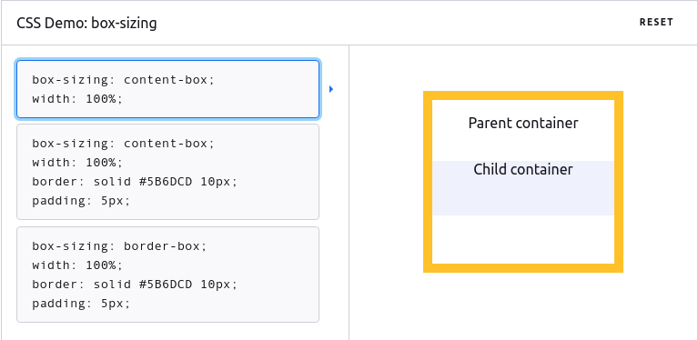

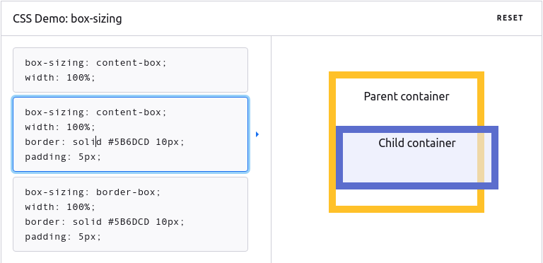

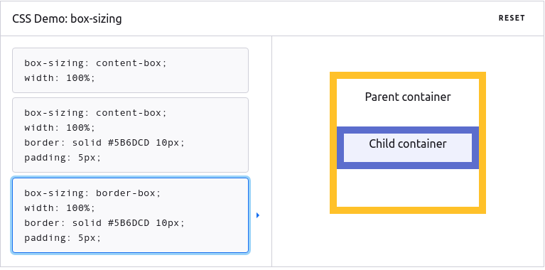

## Flexbox

Following code gives:

```html
<!DOCTYPE html>
<html lang="en">
  <head>
    <meta charset="utf-8" />
    <meta http-equiv="x-ua-compatible" content="ie=edge" />
    <meta name="viewport" content="width=device-width, initial-scale=1.0" />
    <title>flexbox</title>
    <style>
      .el--1 {
        background-color: blueviolet;
      }
      .el--2 {
        background-color: orangered;
      }
      .el--3 {
        background-color: green;
        height: 250px;
      }
      .el--4 {
        background-color: goldenrod;
      }
      .el--5 {
        background-color: palevioletred;
      }
      .el--6 {
        background-color: steelblue;
      }
      .el--7 {
        background-color: yellow;
      }
      .el--8 {
        background-color: crimson;
      }

      .container {
        /* starter */
        font-family: sans-serif;
        background-color: #ddd;
        font-size: 34px;
        margin: 40px;
      }
    </style>
  </head>
  <body>
    <div class="container">
      <div class="el el--1">html</div>
      <div class="el el--2">and</div>
      <div class="el el--3">css</div>
      <div class="el el--4">are</div>
      <div class="el el--5">amazing</div>
      <div class="el el--6">languages</div>
      <div class="el el--7">to</div>
      <div class="el el--8">learn</div>
    </div>
  </body>
</html>
```

Following output:


Please note that all child elements of the `<div class="container">` will be
affected of the `flex` configuration.

### Base configuration

Adding:

```css
.container {
  display: flex;
}
```

Activates flexbox. This gives the output:


Please note that:

- The grey color is the background color of the container (the empty part of the
  container).
- Horizontally, each element takes up the exactly space to fit its content.
- Vertically, all the elements takes the size of the tallest element. in this
  case the `CSS` box which has a height of 250 px.

### `align-items: center`

Adding:

```css
.container {
  display: flex;
  align-items: center;
}
```

Will basically align all the boxes at the center of the container. Elements
will be at their true height.


### `align-items: flex-start`

```css
.container {
  display: flex;
  align-items: flex-start;
}
```

Aligns all the boxes at the start of the container. Elements will be at their
true height.


### `align-items: flex-end`

```css
.container {
  display: flex;
  align-items: flex-end;
}
```

Aligns all the boxes at the end of the container. Elements will be at their true
height.


### `align-items: stretch`

```css
.container {
  display: flex;
  align-items: stretch;
}
```

Stretches the boxes to match the height of the tallest element in the container.
The width will be exactly so that it fits its content of each box.


### `justify-content: center`

Centers the elements in the container in the middle

```css
.container {
  display: flex;
  justify-content: center;
}
```


### `justify-content: space-between`

Sets equal space among the elements to match the horizontal size of container.

```css
.container {
  display: flex;
  justify-content: space-between;
}
```


### Spacing and aligning flex items (combining justify-content and align-items)

- `align-items:` Vertical alignment
- `justify-content:` Horizontal alignment

Using following CSS code for the container:

```css
.container {
  /* starter */
  font-family: sans-serif;
  background-color: #ddd;
  font-size: 34px;
  margin: 40px;
  display: flex;
  align-items: center;
  justify-content: flex-start;
}
```


### Overriding `align-items:` for elements with `align-self:`

You can override this for several or one element with the `align-self:` attribute.

Example 1:

```css
.el--1 {
  align-self: flex-start;
}
```


Example 2:

```css
.el--5 {
  align-self: stretch;
}
```


### Rearranging individual elements with `order:`

Example 1:

```css
.el--6 {
  order: -1;
}
```


Example 2:

```css
.el--5 {
  order: 1;
}
```


### Adding space between items with `gap:`

Example:

```css
.container {
  font-family: sans-serif;
  background-color: #ddd;
  font-size: 34px;
  margin: 40px;
  display: flex;
  align-items: center;
  justify-content: flex-start;
  gap: 30px;
}
```

Given gap between the elements of 30px:


### The `flex` property

`flex:` property is a short for `flex-grow:`, `flex-shrink:` and `flex-basis:`.
So for example, `flex: 0 0 200px;` actually means:

```css
.el {
  flex-grow: 0;
  flex-shrink: 0;
  flex-basis: 200px;
}
```

You should always use `flex:` and not the other three ones.

The default property of flex is:

```css
.el {
  flex-grow: 0;
  flex-shrink: 1;
  flex-basis: auto;
}
```

#### width of elements with flex

With `flex`, you should not use the `width:` property, you should instead use `flex-basis:`.

Example:

```css
.el {
  flex-basis: 100px;
}
```


#### `flex-shrink:` property

Please note that with `flex-basis: 100px`, normally, the width of the elements will
extend to 100 px. But if the content in the element has larger size than
specified, e.g. 100 px as in the prior example, the `flex-basis:` property will
extend 100 px until it fits its contents. This is actually a feature of the
`flex-grow:` property.

Another note is that if you give the elements a really big size, lets say for
example 200px. The elements will extend to so its fits its container, not more.
So the ultimate width of its element will be smaller if 200 px is to large. The
browser will calibrate the width so the elements exactly fits its container.
This feature is coming from the default value of `flex-shrink:1`.

Example:

```css
.el {
  /* default flex portperties */
  /* flex-grow: 0;
  flex-shrink: 1;
  flex-basis: auto; */

  flex-basis: 200px;
}
```

Will give the following output:


If we now edit the default property of `flex-shrink:1` to `flex-shrink: 0`. This
gives:

```css
.el {
  /* default flex portperties */
  /* flex-grow: 0;*/
  flex-shrink: 0;
  /* flex-basis: auto; */

  flex-basis: 200px;
}
```


This basically forces every element to 200px even if it extends beyond the container.

#### `flex-grow:` property

The following code:

```css
.el {
  flex-shrink: 0;
}
```

Gives:


But extending the code with,

```css
.el {
  flex-shrink: 0;
  flex-grow: 1;
}
```

gives the output:


The `flex-grow:1` property divides the maxiumum space in the container evenly
among the elements inside the container.

If you set the `flex-grow:1` property for an individual element, the other
elements will fill up its content and the element that has the property
`flex-grow:1` will fill up the rest of the empty space isnide the container.

```css
.el--1 {
  flex-grow: 1;
}
```

Gives:


The value of `flex-grow:` is also relative to the rest of the elements. for
example, if we in the container have `.el {flex-grow:1}` and in a single element
have `.el--1 { flex-grow:2}`. this means that the element 1 will have 2 times
the size of the available space as compared to the rest of the elements.

## Flex grid

Example with comments:

```css
.container{
  /* INITIATE GRID */
  display: grid;

  /* SET NR OF COLUMNS AND THEIR SIZES */
  /* Two columns, one 250px wide and one 150px wide */
  grid_template-columns: 250px 150px

  /* SET NR OF ROWS AND THEIR SIZES */
  /* Two rows, first row 300px and second 200px */
  grid-template-rows: 300px 200px;

  /* SET GAP BETWEEN ELEMENTS IN THE GRID */
  gap: 30px;

  /* COLUMN AND ROW GAPS CAN ALSO BE SET INDIVIDUALLY */
  column-gap: 30px;
  row-gap:60px;
}
```

Some rules when to use flexbox and when to use grid:

- When you need a one dimensional layout: use flexbox
- When you need a two dimensional layout: use flex grid

Some examples of initiation of grid:

```css
display: grid;

/* Third column (1fr) fills the rest of the empty space */
grid-tempplate-columns: 200px 200px 1fr 100px;
```

```css
display: grid;

/* Column 3 and 4 fills out the empty space */
grid-tempplate-columns: 200px 200px 1fr 1fr;
```

```css
display: grid;

/* All columns fill out thte empty space */
grid-tempplate-columns: 1fr 1fr 1fr 1fr;
```

```css
display: grid;

/* Relative sizing */
grid-tempplate-columns: 1fr 2fr 3fr 4fr;
```

```css
display: grid;

/* 4th column fills out the empty space */
grid-tempplate-columns: 1fr 1fr 1fr auto;
```

```css
display: grid;
/* short for 1fr 1fr 1fr 1fr */
grid-tempplate-columns: repeat(4, 1fr);
```

All the same as above implies for rows.

## Placing and spanning grid items

```css
.el--8 {
  /* grid item should start at the beginning of column nr 2 and end at column 3 */
  grid-column: 2 / 3;
  grid-row: 1 / 2;
}

.el--2 {
  grid-column: 1; /* also possible */
  grid-row: 2; /* also possible */
}

.el--4 {
  grid-column: 1 / 3; /* spans over three columns */
  grid-row: 2; /* also possible */
}

.el--4 {
  grid-column: 1 / span 4; /* another syntax - same as above */
  grid-row: 2;
}

.el--4 {
  grid-column: 1 / -1; /* from the first column to the last column */
  grid-row: 2;
}
```

Spanning works exactly the same with rows i.e. `grid-row`.

## Aligning grid items

```css
/* CSS GRID */
display: grid;
grid-template-column: 125px 200px 125px;
grid-template-rows: 250px 100px;
gap: 50;

/* Aligning tracks inside container */

justify-content: center;
/* justify-content: flex-between; */

align-content: center;
/* align-content:  flex-between; */
/* align-content: end; (Like flex-end in flex-box) */
/* align-content: start; (Like flex-start in flex-box) */

/* Align items inside cells: moving items around inside cells */
aling-items: center;
justify-items: center;

/* Overriding settings in the main container */
.el--3 {
  align-self: end;
  justify-self: end;
}
```

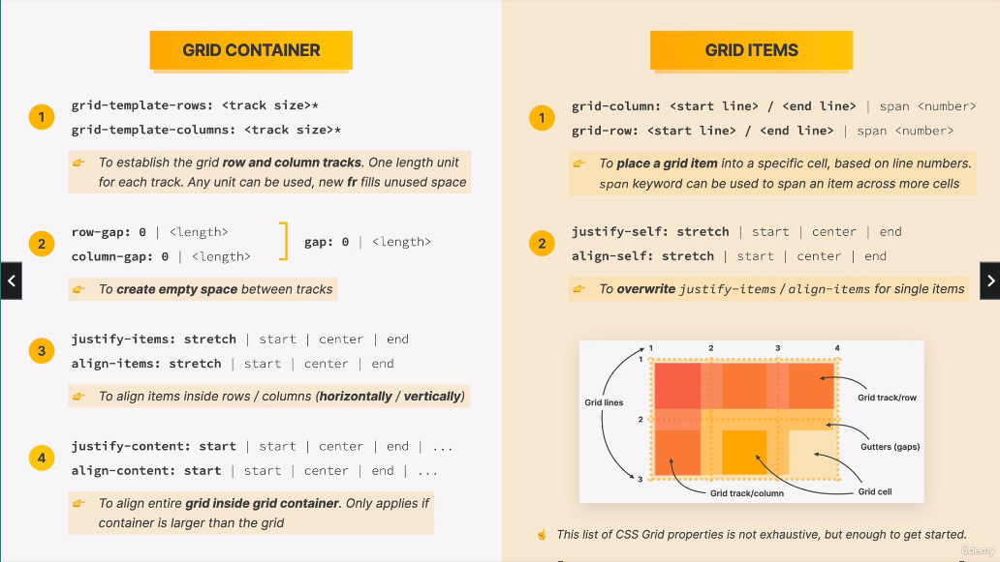

The keyword `display: none` basically removes the container.

### Building a simple CSS grid layouts

```css
display: grid;
grid-template-columns: 125px 200px 125px;
grid-template-rows: 250px 100px;
gap: 50px;

/* Aligning tracks inside container horizontally */
justify-content: center;

/* Aligning tracks inside container vertically */
align-content: center;

/* Aligning items inside cells: moving items around inside cells */
/* Horizontally */
justify-items: center;

/* Verically */
align-items: center;

/* Overide */
/* horizontally */
justify-self: end;

/* Vertically */
align-self: end;
```

- With _span_, you can span the box over several rows / columns.
- If you write grid-column: 1 / -1 it basically indicates that the box should
  span from column 1 to the last column.

## + operator

The `+` sign selector is used to select the elements that are placed immediately
after the specified element but not inside the particular elements.

## `::after` and `::before`

Example:


Example:


## Other

Some random topics:

- Disable bullet points: `ul {list-style = none;}`

- Color can be specified as `rgb(x,y,z)` or `#hexvalue`. `rgba()` also
  specifies transparency.

- Two methods set the first bullet list to another style than the rest of them:
  1. Set class "first-li" to all first `<li>` tags in a list i.e. `<li class="first-li">`
  2. Without modifying the html code, you can write following code in the `css` file
     `li:first-child {font-weight: bold;}` this is called pseudo-classes.

## Spacing system

SPACING SYSTEM (px) 2 / 4 / 8 / 12 / 16 / 24 / 32 / 48 / 64 / 80 / 96 / 128 \
FONT SIZE SYSTEM (px) 10 / 12 / 14 / 16 / 18 / 20 / 24 / 30 / 36 / 44 / 52 / 62 / 74 / 86 / 98

## Initiation of stylesheet

It can be good to initiate your stylesheet with following:

```css
* {
  margin: 0;
  padding: 0;
  box-sizing: border-box;
}

body {
  font-family: 'Your font', sans-serif;
  color: #343a40;
  line-height: 1;
}
```

## Code in <head>

Its good to place following code in the `<head>` tag of the HTML document:

```css
<meta charset="UTF-8" />
<meta http-equiv="X-UA-Compatible" content="IE=edge" />
<meta name="viewport" content="width=device-width, initial-scale=1.0" />
```

## Fonts

Choose your font and weights at fonts.google.com. The weight of the font can
then be selected by:

```css
font-weight: 500; /* As an example */
```

## Flex direction

You can change the direction of flex elements to vertical by `flex-direction: column;`

## Containers

One common way to set the design of a container is to set the size of some
columns to its contents (column 1 and 3 below) and then allocate all the
available space to a certain column (column 2 below).

```css
.container {
  display: grid;
  grid-template-columns: auto 1fr auto;
}
```

## Border color of an icon

Set the border color of an icon with `stroke: #087f5b;`

## Box shadow

You can achieve a nice box shadow with `box-shadow: 0 0 32px rgba(0, 0, 0, 0.1);`

## Styling lists

Its a good procedure to set lists as flex elements:

```css
.hidden-box ul {
  color: #868e96;
  margin-left: 18px;
  display: flex;
  flex-direction: column;
  gap: 12px;
}
```

## Good resources

[Heroicons](https://heroicons.com/)

[Color palettes](https://coolors.co/)

# HTML and CSS Notes

## HTML tags

| tag                              | description                      |
| -------------------------------- | -------------------------------- |
| `<doctype html>`                 | Information                      |
| `<html>`                         |                                  |
| `<head>`                         |                                  |
| `<body>`                         |                                  |
| `<title>`                        |                                  |
| `<header>`                       |                                  |
| `<h1>`                           |                                  |
| `<h2>`                           |                                  |
| `<h3>`                           |                                  |
| `<h4>`                           |                                  |
| `<h5>`                           |                                  |
| `<h6>`                           |                                  |
| `<nav>`                          |                                  |
| `<a href="mypage.html">link</a>` |                                  |
| `<article>`                      |                                  |
| ``         |                                  |
| `<p>`                            |                                  |
| `<strong>`                       |                                  |
| `<b>`                            |                                  |
| `<em>`                           |                                  |
| `<ol>`                           | numbered list                    |
| `<ul>`                           | bullet list                      |
| `<li>`                           | bullet (inside `<ul>` or `<ol>`) |
| `<footer>`                       |                                  |
| `<aside>`                        |                                  |
| `<button>`                       |                                  |
| `<style>`                        | css                              |
| `footer`                         |                                  |
| `<span>`                         |                                  |
| `<blockquote>`                   |                                  |
| `<em>`                           |                                  |

## CSS tags

| tag                          | description                                    |
| ---------------------------- | ---------------------------------------------- |
| `font-size`                  | size of font e.g. 20px                         |
| `font-family`                | font e.g. `sans-serif`                         |
| `text-transform`             | lowercase, uppercase etc.                      |
| `font-style`                 | italic, bold, etc                              |
| `text-align`                 | left, center, right, etc                       |
| `line-height`                | spacing between lines e.g for `<p>`            |
| `list-style`                 | square, circle, number                         |
| `background-color`           | background color for area                      |
| `border`                     | border                                         |
| `border-top`                 | top border                                     |
| `border-bottom`              | bottom border                                  |
| `border: 5px solid black`    | 5px solid black border                         |
| `* {}`                       | whole document                                 |
| `body {}`                    | whole body tag                                 |
| `margin`                     | sets margin area on all four sides of element  |
| `margin: 1px 2px`            | vertical-horizontal margin                     |
| `margin: 1px 2px 3px`        | top-horizontal-bottom margin                   |
| `margin: 1px 2px 3px 4px`    | top-right-botton-left margin                   |
| `margin-bottom: 1px`         | botton margin                                  |
| `margin-left: 1px`           | left margin                                    |
| `margin-top: 1px`            | top margin                                     |
| `margin-right: 1px`          | right margin                                   |
| `text-align:`                | alignement of text                             |
| `text-transform:`            | e.g. `uppercase` or `lowercase`                |
| `padding:`                   | sets padding area - four sides of element      |
| `font-weight:`               | e.g. `bold`                                    |
| `text-decoration`            | e.g. `underline`, `none`. used with links      |
| `cursor:`                    | sets the mouse cursor at hoover                |
| `<a hre... class="x">x</a>`  | please see below - css and links               |
| `.x:hover {}`                | style at hoover in class `x`                   |
| `.x:active {}`               | style at link click                            |
| `.x:link {}`                 | link style                                     |
| `.x:visited {}`              | link style when visited                        |
| `<ul class="list">`          | see blow for styling                           |
| `.list{list-style: square;}` | squared bullets in list                        |
| `.list li {}`                | styling of each bullet e.g. `margin-left:`     |
| `if <p id="test">`           | use then `#test {}`                            |
| `if <p>`                     | use then `p {}`                                |
| `if <p class="test">`        | use then `.test{}`                             |
| `position:`                  | e.g. `absolute`, `relative`                    |
| `.x{position: relative}`     | offset relative to itself (see: pos below)     |
| `.x{position: absolute}`     | remove from normal flow of doc (pos below)     |
| `width`                      | sets an elements width                         |
| `li:first-child {}`          | first bullet                                   |
| `li:last-child {}`           | last bullet                                    |
| `li:nth-child(even)`         | even numbered bullets                          |
| `display:`                   | e.g. `inline`,`inline-block`,`block` see displ |
| `a:link {}`                  | style for links in `<a>` tags                  |
| `a:hover {}`                 | style for links in `<a>` when hoovered         |
| `a:active {}`                | style for links in `<a>` when clicked          |
| `nav a:link {}`              | style for links in `<a>` which in a `<nav>`    |
| `nav a:link:last-child {}`   | last link in `<a>` -> `<navb>`                 |
| `button {}`                  | design for a `<button>` tag.                   |
| `h3 + p {}`                  | style `<p>` directly after `h3` (see: op)      |
| `h3 + p::first-line {}`      | style first line of the paragraph after `<h3>` |
| `h1::first-letter {}`        | style the first letter in `<h1>`               |
| `element::after {}`          | see ::after and ::before                       |
| `element::before {}`         | see `::after` and `::before`                   |
| `float:`                     | let the element float e.g. `float: left;`      |
| `clear:`                     | clear the float                                |
| `clear: both`                | Clears float on both sides                     |
| `box-sizing:`                | e.g. `border-box` or `content-box`             |

## What is CSS?

CSS stands for Cascading Style Sheets

## How can CSS be sources into a HTML document?

You can insert CSS code inside a HTML document in three different ways i.e.
`Inline CSS`, `Internal CSS` and `External CSS`.

### Inline CSS

`Inline CSS` means writing CSS code inside an HTML element brackets
e.g. `<h1 style="color: blue">This text is blue</h1>`. This is not recommended.

### Internal CSS

`Internal CSS` means writing CSS code inside `<style>` brackets in the HTML
document itself. The `<style>` tags needs to be in the `<head>` section i.e.

```html
<html>
  <head>
    <title>title</title>
    <style>
      h1 {
        color: blue;
      }
    </style>
  </head>
  <body>
    <h1>This text is blue</h1>
  </body>
</html>
```

### External CSS

`External CSS` means creating a external CSS file, typically named `style.css`.
This file is then sourced into the HTML code through placing following code
inside the header brackets `<link href="style.css" rel="stylesheet" />` in the HTML file.

Example of `style.css`:

```css
h1 {
  color: blue;
}
```

Sourcing this file into a HTML document will make all the text between `<h1>`
brackets blue.

## Comments in CSS

In order to enter a comment into a stylesheet, use: `/* comment */`.

## Classes, id-selectors and tags

### IDs

Specify a id in a html tag like `<p id="copyright>` or `<p id="author">` and
then use `#author {}` and `#copyright{}` in the CSS file for styling. Make sure
that there can only be 1 id per html file.

### Classes

If you want to use the styling in more than one place you need to use classes.
You can define a class in the HTML as `<p class="related-author">` and then
style it in the stylesheet through `.related-author{}`.

### Tags

- You can basically give an area a name i.e. `<header>`and then only choose to
  style it with `header {background-color: black;}` if you have similar areas of
  `<header>`, you can basically add a class to it.

- If you want to add a background color to whole document,
  just add `body {background-color: blue;}`

- You can style HTML tags in a stylesheet by providing the tag names in the
  stylesheet e.g. `h1{}`, `p {}`.

## Pseudo-classes

A CSS pseudo-class is a keyword added to a selector that specifies a special
state of the selected element(s). For example, `:hover` can be used to change a
button's color when the user's pointer hovers over it.

```css
/* Any button over which the user's pointer is hovering */
button:hover {
  color: blue;
}
```

Pseudo-classes let you apply a style to an element not only in relation to the
content of the document tree, but also in relation to external factors like the
history of the navigator (`:visited`, for example), the status of its content
(like `:checked` on certain form elements), or the position of the mouse (like
`:hover`, which lets you know if the mouse is over an element or not).

Some other examples of pseudo classes:

```css
/* first list element */
li:first-child {
  font-weight: bold;
}

/* last list element */
li:last-child {
  font-style: italic;
}

/* second list element */
li:nth-child(2) {
  color: red;
}

/* all odd list elements */
li:nth-child(odd) {
  color: black;
}
```

A very common misconception on how
pseudo classes works is following.

```html
<article>
  <header>
    <h2>the basic language of the web: html</h2>

    

    <p id="author">
      posted by <strong>laura jones</strong> on monday, june 21st 2027
    </p>
  </header>
</article>
```

Using following `CSS` code:

`article p:first-child {color:red}` will not work since `<p>` is not the first
child of `<article>`. It is header which is the first child of `<article>`. The
only way it would work is if we use `article header { color: red;}`.

More examples:

- Style first letter in `<h1>` directly from CSS:

```css
h1::first-letter {
  font-style: normal;
  margin-right: 10px;
}
```

- Style first line in all `<p>` tags:

```css
p::first-line {
  color: red;
}
```

- Style the first line in a paragraph directly after a `<h3>` tag:

```css
h3 + p::first-line {
  color: darkorchid;
}
```

- Add a cool "top box" next to a `<h2>` header:

```css
h2 {
position:relative;
}
h2::after {
content: "top";
background-color: yellow;
color:black;
font-size: 16px;
font-weight: bold;
display: inline-block;
padding: 5px 10px;
position: absolute;
top:-15px;
right: -25px;
```

## Inheritance

- If you style `<p>`, all the tags within the `<p>` tag will follow. i.e. if you
  have `<p>hey <strong>you</strong></p>` and you style `<p>`, then `<strong>`
  will inherit the style.

- Inheritance comes from parent tags e.g. style `<a> (link)` and `<p>` tags
  within a `<nav>` tag: `nav a:link, nav p { font-size: 18px; }`

  - You could also just do: `nav { font-size: 18px;}` which basically is the same if
    there is only a `<a>` and a `<p>` tag inside the `<nav>`.

- Universal selector: `* {}`, you could also use `body {}`.

## Combining selectors

Some examples below:

- You can use the same properties for many selectors at the same time e.g.,

```css
h1,
h2,
h3,
h4,
li,
p {
  font-family: sans-serif;
}
```

- Modify `<p>` tags only in the `<footer>` - use then:

```css
footer p {
  font-size: 10px;
}
```

- Same for `<p>` tags in headers:

```css
header p {
  font-style: italic;
}
```

## Conflicts between selectors

1. Should not be used: declaration marked `!important`.
2. Should not be used: inline style (style attribute in html)
3. Highest priority: id selector (last selector gets applied)
4. Class (`.`) or pseudo class (`:`) selector
5. Element selector (p, div, li, etc)
6. Universal selector

## Styling hyperlinks

An example:

```css
/* styling hyperlinks */
a:link {
  color: #1098ad;
  text-decoration: none; /* no underline on links */
}

a:visited {
  color: #1098ad; /* same color on links*/
}

a:hover {
  color: orange;
  font-weight: bold;
  text-decoration: underline dotted orangered;
}

a:active {
  background-color: black;
  font-style: italic;
}
```

## Images

Make images responsive:

Set the width to 100% (100% of its parent element) and height to `auto`,

`.post-img { width: 100%; height: auto;}`

## Centering

### Centering containers

Add container of what you want to center line `<div class="container">`. Add
following in the stylesheet and it will center the page and make it dynamic.

```css
.container {
  width: 700px;
  margin: 0 auto;
```

### Centering text

One usual mistake that people do is that they try to center e.g. text inside
inline elements. For example, you have the HTML code below and want to center
the text with the following CSS code:

```html
<nav>
  <a href="blog.html">blog</a>
  <a href="#">challenges</a>
  <a href="#">flexbox</a>
  <a href="#">css grid</a>
</nav>
```

```css
nav a:link {
  text-align: center;
}
```

This will not work since inline elements don't have any space over for what it
contains.

The solution is that you should place the `text-align:center;` property to its
parent.

```css
nav {
  text-align: center;
}
```

## Position

### Relative

The element is positioned according to the normal flow of the document, and then
offset relative to itself based on the values of top, right, bottom, and left.
The offset does not affect the position of any other elements; thus, the space
given for the element in the page layout is the same as if position were static.

### Absolute

The element is removed from the normal document flow, and no space is created
for the element in the page layout. It is positioned relative to its closest
positioned ancestor, if any; otherwise, it is placed relative to the initial
containing block. Its final position is determined by the values of top,
right, bottom, and left.

### Static

The element is positioned according to the normal flow of the document. the top,
right, bottom, left, and z-index properties have no effect. This is the default
value.

### More

If you want to add a **like button** in the button of the page (right). you can
first add a `<button>` tag in the html code then in the css code you can
specify: `button { position: absolute; bottom: 50px; right: 50px;}` and then in
the body you can add `body {position:relative;}`. You can also add the button
into a container but then you need to specify `.container{position: relative}`
in the stylesheet.

- Absolute/relative positioning should only be used for single elements.

## Display

The display CSS property sets whether an element is treated as a block or inline
element and the layout used for its children, such as flow layout, grid or flex.

Formally, the display property sets an element's inner and outer display types.
The outer type sets an element's participation in flow layout; the inner type
sets the layout of children. Some values of display are fully defined in their
own individual specifications; for example the detail of what happens when
display: flex is declared is defined in the CSS flexible box model specification

### Block

The element generates a block element box, generating line breaks both before
and after the element when in the normal flow.

### Inline

The element generates one or more inline element boxes that do not generate line
breaks before or after themselves. in normal flow, the next element will be on
the same line if there is space.

### Inline-block

The element generates a block element box that will be flowed with surrounding
content as if it were a single inline box (behaving much like a replaced element
would).

### More

- Inline boxes don't create any vertical space outside the element i.e. the
  margin: i.e. `nav a: link {margin: 20px; }` wont work since it does not create
  any vertical space (its an inline element). Padding will indeed work since it
  is inside the box i.e. `nav a:link {padding: 20px;}`.

- To get margin to work on `nav a: link {margin: 20px; }` you first need to
  change it to a block element with `nav a:link {margin:20px; padding:20px; display: block;}`.

- Inline block element are a combination of inline and box elements
  e.g. `nav a: link {margin-top:30px; display:inline-block;}`

- Images are inline-block elements.

## Float

E.g. `float: none`, `float: left;` or `float:right`.

The float CSS property places an element on the left or right side of its
container, allowing text and inline elements to wrap around it. The element is
removed from the normal flow of the page, though still remaining a part of the
flow (in contrast to absolute positioning).

Example of `float:right`:


## Sizing notation

Following codes are equal:

```css
.main-header {
  padding: 20px;
  padding-left: 40px;
  padding-right: 40px;
}
```

```css
.main-header {
  padding: 20px 40px;
}
```

## Layouts

Three types of layouts:

1. Floats
2. Flexbox
3. Grid

## Float

If a container, header, or whatsoever contains child elements which all are
floated, then the height of the container will collapse. you can clear floats
by adding a `<div class="clear"></div>` element into the container and in the
css code state: `.clear {clear: both};`.

You could also add a class called `clearfix` to the parent element and then add
a new last child element
with `.clearfix::after { clear: both; content:''; display: block}`

If the contents don't fit in a dynamic flow based on the components weights, you
can use the `box-sizing: border-box;`. If you want this box model be applied
to all elements on the page, just put it in the universal selector `* {}`. You
cannot put it in the body section since `box-sizing:` doesn't get inherited.

Please see following examples,


## Flexbox

Following code gives:

```html
<!DOCTYPE html>
<html lang="en">
  <head>
    <meta charset="utf-8" />
    <meta http-equiv="x-ua-compatible" content="ie=edge" />
    <meta name="viewport" content="width=device-width, initial-scale=1.0" />
    <title>flexbox</title>
    <style>
      .el--1 {
        background-color: blueviolet;
      }
      .el--2 {
        background-color: orangered;
      }
      .el--3 {
        background-color: green;
        height: 250px;
      }
      .el--4 {
        background-color: goldenrod;
      }
      .el--5 {
        background-color: palevioletred;
      }
      .el--6 {
        background-color: steelblue;
      }
      .el--7 {
        background-color: yellow;
      }
      .el--8 {
        background-color: crimson;
      }

      .container {
        /* starter */
        font-family: sans-serif;
        background-color: #ddd;
        font-size: 34px;
        margin: 40px;
      }
    </style>
  </head>
  <body>
    <div class="container">
      <div class="el el--1">html</div>
      <div class="el el--2">and</div>
      <div class="el el--3">css</div>
      <div class="el el--4">are</div>
      <div class="el el--5">amazing</div>
      <div class="el el--6">languages</div>
      <div class="el el--7">to</div>
      <div class="el el--8">learn</div>
    </div>
  </body>
</html>
```

Following output:


Please note that all child elements of the `<div class="container">` will be
affected of the `flex` configuration.

### Base configuration

Adding:

```css
.container {
  display: flex;
}
```

Activates flexbox. This gives the output:


Please note that:

- The grey color is the background color of the container (the empty part of the
  container).
- Horizontally, each element takes up the exactly space to fit its content.
- Vertically, all the elements takes the size of the tallest element. in this
  case the `CSS` box which has a height of 250 px.

### `align-items: center`

Adding:

```css
.container {
  display: flex;
  align-items: center;
}
```

Will basically align all the boxes at the center of the container. Elements
will be at their true height.


### `align-items: flex-start`

```css
.container {
  display: flex;
  align-items: flex-start;
}
```

Aligns all the boxes at the start of the container. Elements will be at their
true height.


### `align-items: flex-end`

```css
.container {
  display: flex;
  align-items: flex-end;
}
```

Aligns all the boxes at the end of the container. Elements will be at their true
height.


### `align-items: stretch`

```css
.container {
  display: flex;
  align-items: stretch;
}
```

Stretches the boxes to match the height of the tallest element in the container.
The width will be exactly so that it fits its content of each box.


### `justify-content: center`

Centers the elements in the container in the middle

```css
.container {
  display: flex;
  justify-content: center;
}
```


### `justify-content: space-between`

Sets equal space among the elements to match the horizontal size of container.

```css
.container {
  display: flex;
  justify-content: space-between;
}
```


### Spacing and aligning flex items (combining justify-content and align-items)

- `align-items:` Vertical alignment
- `justify-content:` Horizontal alignment

Using following CSS code for the container:

```css
.container {
  /* starter */
  font-family: sans-serif;
  background-color: #ddd;
  font-size: 34px;
  margin: 40px;
  display: flex;
  align-items: center;
  justify-content: flex-start;
}
```


### Overriding `align-items:` for elements with `align-self:`

You can override this for several or one element with the `align-self:` attribute.

Example 1:

```css
.el--1 {
  align-self: flex-start;
}
```


Example 2:

```css
.el--5 {
  align-self: stretch;
}
```


### Rearranging individual elements with `order:`

Example 1:

```css
.el--6 {
  order: -1;
}
```


Example 2:

```css
.el--5 {
  order: 1;
}
```


### Adding space between items with `gap:`

Example:

```css
.container {
  font-family: sans-serif;
  background-color: #ddd;
  font-size: 34px;
  margin: 40px;
  display: flex;
  align-items: center;
  justify-content: flex-start;
  gap: 30px;
}
```

Given gap between the elements of 30px:


### The `flex` property

`flex:` property is a short for `flex-grow:`, `flex-shrink:` and `flex-basis:`.
So for example, `flex: 0 0 200px;` actually means:

```css
.el {
  flex-grow: 0;
  flex-shrink: 0;
  flex-basis: 200px;
}
```

You should always use `flex:` and not the other three ones.

The default property of flex is:

```css
.el {
  flex-grow: 0;
  flex-shrink: 1;
  flex-basis: auto;
}
```

#### width of elements with flex

With `flex`, you should not use the `width:` property, you should instead use `flex-basis:`.

Example:

```css
.el {
  flex-basis: 100px;
}
```


#### `flex-shrink:` property

Please note that with `flex-basis: 100px`, normally, the width of the elements will
extend to 100 px. But if the content in the element has larger size than
specified, e.g. 100 px as in the prior example, the `flex-basis:` property will
extend 100 px until it fits its contents. This is actually a feature of the
`flex-grow:` property.

Another note is that if you give the elements a really big size, lets say for
example 200px. The elements will extend to so its fits its container, not more.
So the ultimate width of its element will be smaller if 200 px is to large. The
browser will calibrate the width so the elements exactly fits its container.
This feature is coming from the default value of `flex-shrink:1`.

Example:

```css
.el {
  /* default flex portperties */
  /* flex-grow: 0;
  flex-shrink: 1;
  flex-basis: auto; */

  flex-basis: 200px;
}
```

Will give the following output:


If we now edit the default property of `flex-shrink:1` to `flex-shrink: 0`. This
gives:

```css
.el {
  /* default flex portperties */
  /* flex-grow: 0;*/
  flex-shrink: 0;
  /* flex-basis: auto; */

  flex-basis: 200px;
}
```


This basically forces every element to 200px even if it extends beyond the container.

#### `flex-grow:` property

The following code:

```css
.el {
  flex-shrink: 0;
}
```

Gives:


But extending the code with,

```css
.el {
  flex-shrink: 0;
  flex-grow: 1;
}
```

gives the output:


The `flex-grow:1` property divides the maxiumum space in the container evenly
among the elements inside the container.

If you set the `flex-grow:1` property for an individual element, the other
elements will fill up its content and the element that has the property
`flex-grow:1` will fill up the rest of the empty space isnide the container.

```css
.el--1 {
  flex-grow: 1;
}
```

Gives:


The value of `flex-grow:` is also relative to the rest of the elements. for
example, if we in the container have `.el {flex-grow:1}` and in a single element
have `.el--1 { flex-grow:2}`. this means that the element 1 will have 2 times
the size of the available space as compared to the rest of the elements.

## Flex grid

Example with comments:

```css
.container{
  /* INITIATE GRID */
  display: grid;

  /* SET NR OF COLUMNS AND THEIR SIZES */
  /* Two columns, one 250px wide and one 150px wide */
  grid_template-columns: 250px 150px

  /* SET NR OF ROWS AND THEIR SIZES */
  /* Two rows, first row 300px and second 200px */
  grid-template-rows: 300px 200px;

  /* SET GAP BETWEEN ELEMENTS IN THE GRID */
  gap: 30px;

  /* COLUMN AND ROW GAPS CAN ALSO BE SET INDIVIDUALLY */
  column-gap: 30px;
  row-gap:60px;
}
```

Some rules when to use flexbox and when to use grid:

- When you need a one dimensional layout: use flexbox
- When you need a two dimensional layout: use flex grid

Some examples of initiation of grid:

```css
display: grid;

/* Third column (1fr) fills the rest of the empty space */
grid-tempplate-columns: 200px 200px 1fr 100px;
```

```css
display: grid;

/* Column 3 and 4 fills out the empty space */
grid-tempplate-columns: 200px 200px 1fr 1fr;
```

```css
display: grid;

/* All columns fill out thte empty space */
grid-tempplate-columns: 1fr 1fr 1fr 1fr;
```

```css
display: grid;

/* Relative sizing */
grid-tempplate-columns: 1fr 2fr 3fr 4fr;
```

```css
display: grid;

/* 4th column fills out the empty space */
grid-tempplate-columns: 1fr 1fr 1fr auto;
```

```css
display: grid;
/* short for 1fr 1fr 1fr 1fr */
grid-tempplate-columns: repeat(4, 1fr);
```

All the same as above implies for rows.

## Placing and spanning grid items

```css
.el--8 {
  /* grid item should start at the beginning of column nr 2 and end at column 3 */
  grid-column: 2 / 3;
  grid-row: 1 / 2;
}

.el--2 {
  grid-column: 1; /* also possible */
  grid-row: 2; /* also possible */
}

.el--4 {
  grid-column: 1 / 3; /* spans over three columns */
  grid-row: 2; /* also possible */
}

.el--4 {
  grid-column: 1 / span 4; /* another syntax - same as above */
  grid-row: 2;
}

.el--4 {
  grid-column: 1 / -1; /* from the first column to the last column */
  grid-row: 2;
}
```

Spanning works exactly the same with rows i.e. `grid-row`.

## Aligning grid items

```css
/* CSS GRID */
display: grid;
grid-template-column: 125px 200px 125px;
grid-template-rows: 250px 100px;
gap: 50;

/* Aligning tracks inside container */

justify-content: center;
/* justify-content: flex-between; */

align-content: center;
/* align-content:  flex-between; */
/* align-content: end; (Like flex-end in flex-box) */
/* align-content: start; (Like flex-start in flex-box) */

/* Align items inside cells: moving items around inside cells */
aling-items: center;
justify-items: center;

/* Overriding settings in the main container */
.el--3 {
  align-self: end;
  justify-self: end;
}
```


The keyword `display: none` basically removes the container.

### Building a simple CSS grid layouts

```css
display: grid;
grid-template-columns: 125px 200px 125px;
grid-template-rows: 250px 100px;
gap: 50px;

/* Aligning tracks inside container horizontally */
justify-content: center;

/* Aligning tracks inside container vertically */
align-content: center;

/* Aligning items inside cells: moving items around inside cells */
/* Horizontally */
justify-items: center;

/* Verically */
align-items: center;

/* Overide */
/* horizontally */
justify-self: end;

/* Vertically */
align-self: end;
```

- With _span_, you can span the box over several rows / columns.
- If you write grid-column: 1 / -1 it basically indicates that the box should
  span from column 1 to the last column.

## + operator

The `+` sign selector is used to select the elements that are placed immediately
after the specified element but not inside the particular elements.

## `::after` and `::before`

Example:


Example:


## Other

Some random topics:

- Disable bullet points: `ul {list-style = none;}`

- Color can be specified as `rgb(x,y,z)` or `#hexvalue`. `rgba()` also
  specifies transparency.

- Two methods set the first bullet list to another style than the rest of them:
  1. Set class "first-li" to all first `<li>` tags in a list i.e. `<li class="first-li">`
  2. Without modifying the html code, you can write following code in the `css` file
     `li:first-child {font-weight: bold;}` this is called pseudo-classes.

## Spacing system

SPACING SYSTEM (px) 2 / 4 / 8 / 12 / 16 / 24 / 32 / 48 / 64 / 80 / 96 / 128 \
FONT SIZE SYSTEM (px) 10 / 12 / 14 / 16 / 18 / 20 / 24 / 30 / 36 / 44 / 52 / 62 / 74 / 86 / 98

## Initiation of stylesheet

It can be good to initiate your stylesheet with following:

```css
* {
  margin: 0;
  padding: 0;
  box-sizing: border-box;
}

body {
  font-family: 'Your font', sans-serif;
  color: #343a40;
  line-height: 1;
}
```

## Code in <head>

Its good to place following code in the `<head>` tag of the HTML document:

```css
<meta charset="UTF-8" />
<meta http-equiv="X-UA-Compatible" content="IE=edge" />
<meta name="viewport" content="width=device-width, initial-scale=1.0" />
```

## Fonts

Choose your font and weights at fonts.google.com. The weight of the font can
then be selected by:

```css
font-weight: 500; /* As an example */
```

## Flex direction

You can change the direction of flex elements to vertical by `flex-direction: column;`

## Containers

One common way to set the design of a container is to set the size of some
columns to its contents (column 1 and 3 below) and then allocate all the
available space to a certain column (column 2 below).

```css
.container {
  display: grid;
  grid-template-columns: auto 1fr auto;
}
```

## Border color of an icon

Set the border color of an icon with `stroke: #087f5b;`

## Box shadow

You can achieve a nice box shadow with `box-shadow: 0 0 32px rgba(0, 0, 0, 0.1);`

## Styling lists

Its a good procedure to set lists as flex elements:

```css
.hidden-box ul {
  color: #868e96;
  margin-left: 18px;
  display: flex;
  flex-direction: column;
  gap: 12px;
}
```

## `transform: scale(x)`

Scales an element with `x`.

You can also construct an image or an element that extends its container with
`scale()`. See below for example:

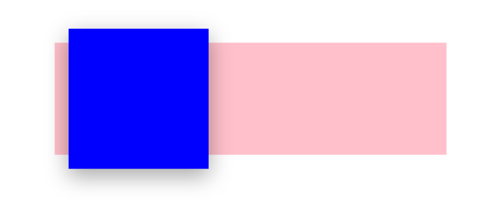

This can be achieved by following code:

```html
<!DOCTYPE html>
<html>
  <head>
    <style>
      * {
        margin: 0;
        padding: 0;
        box-sizing: border-box;
      }

      .container {
        /* SIZE */
        width: 700px;
        height: 200px;

        /* LOCATION */
        margin: 100px auto;
        padding-left: 100px;

        /* COLORING */
        background-color: pink;

        /* FLEX */
        display: flex;
        align-items: center;
        gap: 100px;
      }

      .box {
        width: 100px;
        height: 100px;
        background-color: blue;
      }

      .box-first {
        transform: scale(2.5);
        box-shadow: rgba(0, 0, 0, 0.35) 0px 5px 15px;
      }
    </style>
  </head>
  <body>
    <div class="container">
      <div class="box box-first"></div>
    </div>
  </body>
</html>
```

## `tranform: translate(x,y)`

Centering of buttons or other elements on different sides e.g. as the image
below can be achieved byt the enclosed code below.

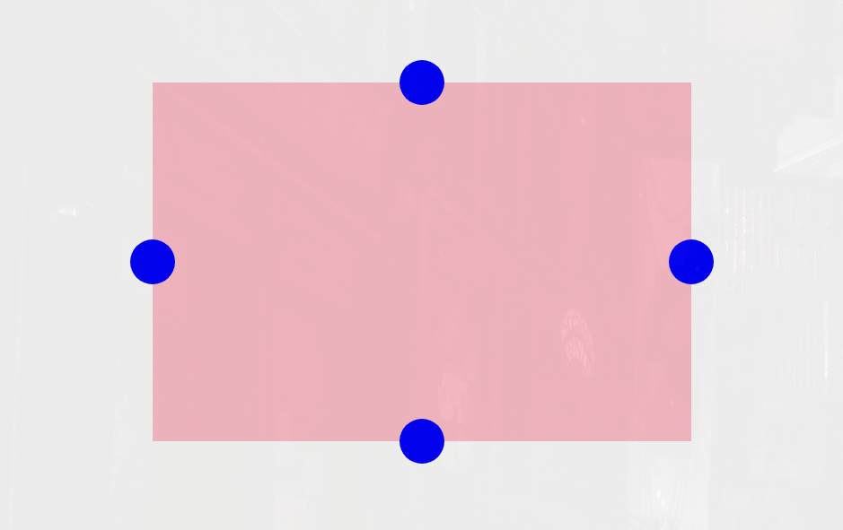

```html
<!DOCTYPE html>
<html>
  <head>
    <style>
      * {
        margin: 0;
        padding: 0;
        box-sizing: border-box;
      }

      .container {
        width: 600px;
        height: 400px;
        margin: 100px auto;
        background-color: pink;
        position: relative;
      }

      .btn {
        width: 50px;
        height: 50px;
        border-radius: 50%;
        background-color: blue;
        cursor: pointer;
        position: absolute;
      }

      .btn-mid-left {
        top: 50%;
        left: 0;

        transform: translate(-50%, -50%);
      }

      .btn-mid-right {
        top: 50%;
        right: 0;

        transform: translate(50%, -50%);
      }

      .btn-mid-top {
        top: 0;
        left: 50%;
        transform: translate(-50%, -50%);
      }

      .btn-mid-bottom {
        bottom: 0;
        left: 50%;
        transform: translate(-50%, 50%);
      }
    </style>
  </head>
  <body>
    <div class="container">
      <div class="btn btn-mid-left"></div>
      <div class="btn btn-mid-right"></div>
      <div class="btn btn-mid-top"></div>
      <div class="btn btn-mid-bottom"></div>
    </div>
  </body>
</html>
```

## Tables

Example table:

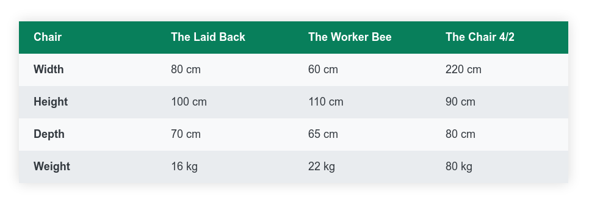

Code table:

```html
<html>
  <head>
    <style>
      * {
        margin: 0;
        padding: 0;
        box-sizing: border-box;
      }

      body {
        color: #343a40;
        line-height: 1;
      }

      table {
        width: 900px;
        margin: 0 auto;
        margin-top: 100px;
        border-collapse: collapse;
        box-shadow: 0 0 20px rgba(0, 0, 0, 0.15);
        font-size: 18px;
      }

      th,
      td {
        padding: 16px 24px;
        text-align: left;
      }

      thead th {
        background-color: #087f5b;
        color: #fff;
        width: 25%;
      }

      tbody tr:nth-of-type(even) {
        background-color: #e9ecef;
      }

      tbody tr:nth-of-type(odd) {
        background-color: #f8f9fa;
      }
    </style>
  </head>
  <body>
    <table>
      <thead>
        <tr>
          <th>Chair</th>
          <th>The Laid Back</th>
          <th>The Worker Bee</th>
          <th>The Chair 4/2</th>
        </tr>
      </thead>
      <tbody>
        <tr>
          <th>Width</th>
          <td>80 cm</td>
          <td>60 cm</td>
          <td>220 cm</td>
        </tr>

        <tr>
          <th>Height</th>
          <td>100 cm</td>
          <td>110 cm</td>
          <td>90 cm</td>
        </tr>
        <tr>
          <th>Depth</th>
          <td>70 cm</td>
          <td>65 cm</td>
          <td>80 cm</td>
        </tr>

        <tr>
          <th>Weight</th>
          <td>16 kg</td>
          <td>22 kg</td>
          <td>80 kg</td>
        </tr>
      </tbody>
    </table>
  </body>
</html>
```

## Pagination

You can create a pagination component with the following code:

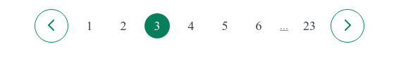

```html
<!DOCTYPE html>
<html>
  <head>
    <style>
      * {
        margin: 0;
        padding: 0;
        box-sizing: border-box;
      }

      body {
        color: #343a40;
        line-height: 1;

        display: flex;
        justify-content: center;
      }

      .pagination {
        /*
      FOLLOWING CODE IS RISKY SINCE YOU DONT KNOW HOW MANY ITEMS THERE
      THERE CAN BE IN THE PAGINATION. BETTER TO ADJUST FOR THIS IN THE
      BODY. THIS CAN BE ACHIEVED BY MAKING THE BODY A FLEX CONTAINER.

      THE REASON FOR THIS IS THAT IF YOU DO NOT PROVIDE A WIDTH FOR AN ELEMENT
      THE MARGIN WILL NOT WORK.

      width: 900px;
      margin: 10px auto;
      */
        margin: 20px auto;
        display: flex;
        align-items: center;
        justify-content: center;
        gap: 12px;
      }

      .btn {
        border: 1px solid #087f5b;
        height: 48px;
        width: 48px;
        border-radius: 50%;
        background: none;
        cursor: pointer;
      }

      .btn-icon {
        height: 24px;
        width: 24px;
        stroke: #087f5b;
      }

      .page-link:link,
      .page-link:visited {
        font-size: 18px;
        color: #343a40;
        text-decoration: none;
        height: 36px;
        width: 36px;
        border-radius: 50%;
        /* A TRICK TO CENTER THE LINKS */
        display: flex;
        align-items: center;
        justify-content: center;
      }

      .page-link:hover,
      .page-link:active,
      /* TRICK TO MAKE THE CURRENT PAGE ALSO HAVE WHITE TEXT WITH GREEN BACKGROUND */
      /* MEANS SELECTING BOTH CLASSES page-link AND page-link--current */
      .page-link.page-link--current {
        background-color: #087f5b;
        color: #fff;
      }

      .btn:hover {
        background-color: #087f5b;
      }

      /* WE WANT THE ICON BECOME WHITE AS SOON AS WE HOOVER THE BTN */
      .btn:hover .btn-icon {
        stroke: #fff;
      }

      .dots {
        color: #868e96;
      }
    </style>
  </head>
  <body>
    <div class="pagination">
      <button class="btn">
        <svg
          xmlns="http://www.w3.org/2000/svg"
          class="btn-icon"
          fill="none"
          viewBox="0 0 24 24"
          stroke="currentColor"
        >
          <path
            stroke-linecap="round"
            stroke-linejoin="round"
            stroke-width="2"
            d="M15 19l-7-7 7-7"
          />
        </svg>
      </button>
      <a href="#" class="page-link">1</a>
      <a href="#" class="page-link">2</a>
      <a href="#" class="page-link page-link--current">3</a>
      <a href="#" class="page-link">4</a>
      <a href="#" class="page-link">5</a>
      <a href="#" class="page-link">6</a>
      <a href="#" class="dots">...</a>
      <a href="#" class="page-link">23</a>
      <button class="btn">
        <svg
          xmlns="http://www.w3.org/2000/svg"
          class="btn-icon"
          fill="none"
          viewBox="0 0 24 24"
          stroke="currentColor"
        >
          <path
            stroke-linecap="round"
            stroke-linejoin="round"
            stroke-width="2"
            d="M9 5l7 7-7 7"
          />
        </svg>
      </button>
    </div>
  </body>
</html>
```

## Viewport

You can set a section to take up the whole viewports size. For example, if you
want to cover a section of a webpage to 100% of the height of the viewport, you
can set following.

Following code needs to be in the `<head>` brackets.

```html
<meta charset="UTF-8" />
<meta http-equiv="X-UA-Compatible" content="IE=edge" />
<meta name="viewport" content="width=device-width, initial-scale=1.0" />
```

and then set the styling as:

```css
section {
  height: 100vh;
}
```

## Linear gradient

Some gradient examples:

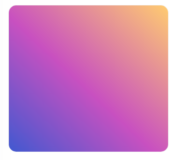

```css
background-color: #4158d0;
background-image: linear-gradient(43deg, #4158d0 0%, #c850c0 46%, #ffcc70 100%);
```

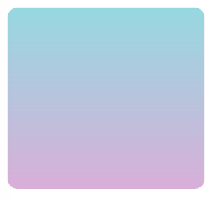

```css
background-color: #d9afd9;
background-image: linear-gradient(0deg, #d9afd9 0%, #97d9e1 100%);
```


```css
background-color: #f4d03f;
background-image: linear-gradient(132deg, #f4d03f 0%, #16a085 100%);
```

## Background images

Some examples:

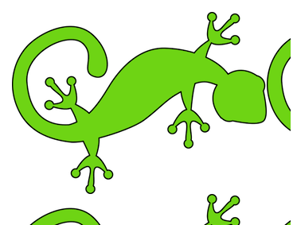

```css
background-image: url('../../media/examples/lizard.png');
```

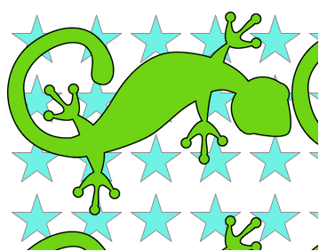

```css
background-image: url('../../media/examples/lizard.png'),
  url('../../media/examples/star.png');
```

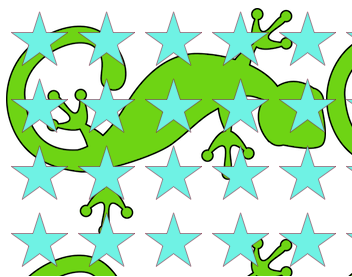

```css
background-image: url('../../media/examples/star.png'),
  url('../../media/examples/lizard.png');
```

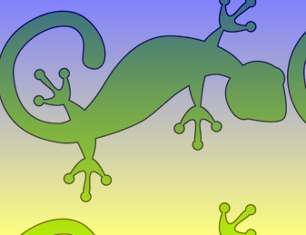

```css
background-image: linear-gradient(rgba(0, 0, 255, 0.5), rgba(255, 255, 0, 0.5)),
  url('../../media/examples/lizard.png');
```

- Please note that you can stack images on top of each other like in the examples.
  This applies to gradients as well.

## Background image size

You can set the background image size with following syntax. See examples below,

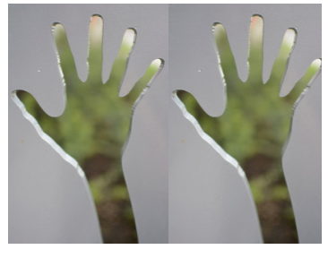

```css
background-size: contain;
```

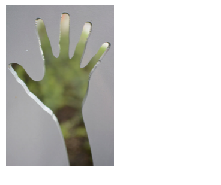

```css
background-size: contain;
background-repeat: no-repeat;
```

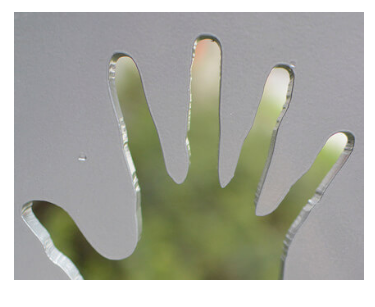

```css
background-size: cover;
```

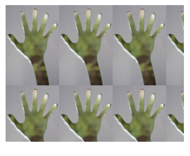

```css
background-size: 30%;
```

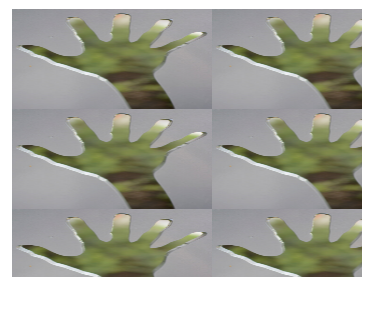

```css
background-size: 200px 100px;
```

## Setting the size of a sub container

You can set the size of the parent container with for example:

```css
.header-container {
  width: 1200px;
}
```

and then you can set the subcontainer to a % of the size of the parent:

```css
.header-container-inner {
  width: 50%;
}
```

## Spreading buttons

You can achieve following menu with following code. Please note the trick to
get the last button furthest out to the right.


```css
menu {
  background-color: #7048e8;
  color: #fff;
  grid-column: 2 / -1;
  display: flex;
  align-items: center;
  gap: 12px;
  padding: 0 40px;
}

button {
  display: inline-block;
  font-size: 16px;
  font-weight: bold;
  background-color: #5f3dc4;
  border: none;
  cursor: pointer;
  color: #fff;
  padding: 8px 12px;
}

button:last-child {
  background-color: #d6336c;
  /* TRICK TO PUT THE LAST ITEM IN THE END */
  margin-left: auto;
}

<menu>
  <button>New</button>
  <button>Reply</button>
  <button>Forward</button>
  <button>Mark unread</button>
  <button>Trash</button>
</menu>
```

## Aligning items

A smart trick to have the same aligning of text and items is to have the same padding i.e.

```css
nav,
section,
main,
aside {
  padding-top: 24px;
}
```

## Flex scroll

If you have a page with the height of 100% of the viewport and the items in one
column extend beyond that. Then you can implement a scroll wheel with:

```css
flex-shrink: scroll;
```

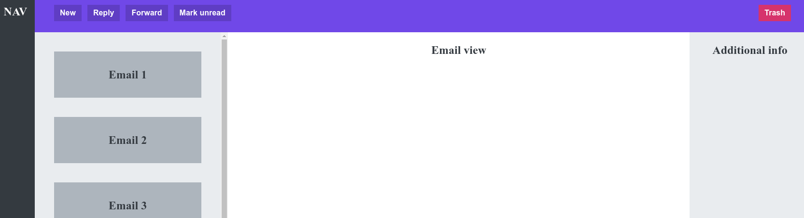

with relation to this picture.

## Example of email app

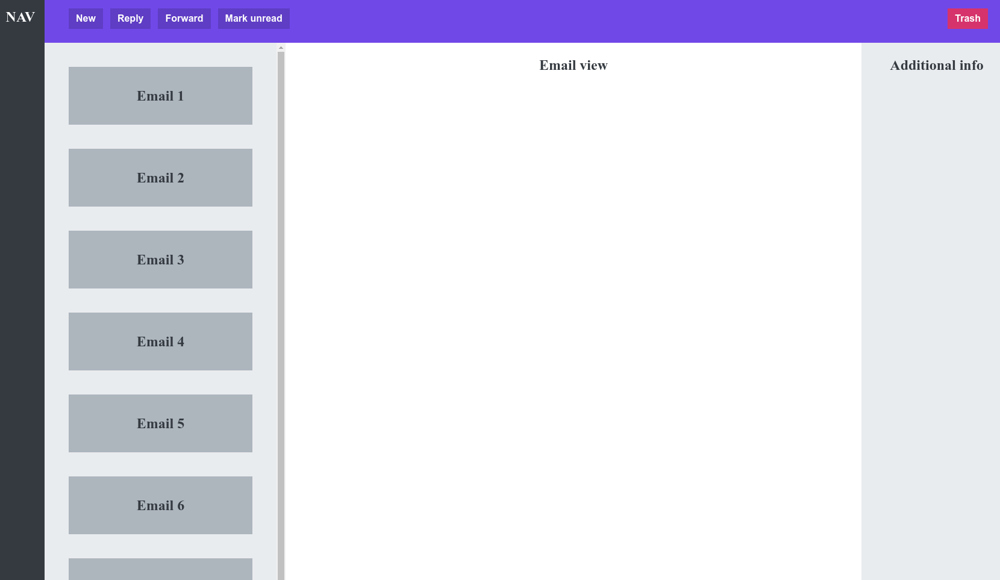

```html
<!DOCTYPE html>
<html>
  <head>
    <meta charset="UTF-8" />
    <meta http-equiv="X-UA-Compatible" content="IE=edge" />
    <meta name="viewport" content="width=device-width, initial-scale=1.0" />
    <title>Omifood Hero Section</title>
    <style>
      * {
        margin: 0;
        padding: 0;
        box-sizing: border-box;
      }

      body {
        font-size: sans-serif;
        color: #343a40;
        font-size: 24px;
        text-align: center;
        font-weight: bold;
        /* HEIGHT OF THE BODY SHOULD BE 100% OF VIEW-PORT */
        height: 100vh;
        display: grid;
        grid-template-columns: 80px 400px 1fr 250px;
        grid-template-rows: 80px 1fr;
      }

      nav,
      section,
      main,
      aside {
        padding-top: 24px;
      }

      nav {
        background-color: #343a40;
        color: white;
        grid-row: 1 / -1;
      }

      menu {
        background-color: #7048e8;
        color: #fff;
        grid-column: 2 / -1;
        display: flex;
        align-items: center;
        gap: 12px;
        padding: 0 40px;
      }

      button {
        display: inline-block;
        font-size: 16px;
        font-weight: bold;
        background-color: #5f3dc4;
        border: none;
        cursor: pointer;
        color: #fff;
        padding: 8px 12px;
      }

      button:last-child {
        background-color: #d6336c;
        /* TRICK TO PUT THE LAST ITEM IN THE END */
        margin-left: auto;
      }

      aside {
        background-color: #e9ecef;
      }

      section {
        background-color: #e9ecef;
        padding: 40px;
        /* THIS ALONE WILL SHINK ALL THE FLEX ITEMS */
        /* DOESNT HAVE ANYTHING TO DO WITH FLEXBOX */
        overflow: scroll;
        display: flex;
        gap: 40px;
        flex-direction: column;
      }

      .email {
        background-color: #adb5bd;
        height: 96px;
        /* ONLY NECASSARY SINCE WE ARE USING FLEXBOX, OTHERWISE, THE overflow: scroll WOULD BE ENOUGH */
        flex-shrink: 0;

        /* FLEX BOX TREATS TEXT AS AN FLEX ITEM */
        display: flex;
        align-items: center;
        justify-content: center;
      }
    </style>
  </head>
  <body>
    <nav>NAV</nav>
    <menu>
      <button>New</button>
      <button>Reply</button>
      <button>Forward</button>
      <button>Mark unread</button>
      <button>Trash</button>
    </menu>
    <section>
      <div class="email">Email 1</div>
      <div class="email">Email 2</div>
      <div class="email">Email 3</div>
      <div class="email">Email 4</div>
      <div class="email">Email 5</div>
      <div class="email">Email 6</div>
      <div class="email">Email 7</div>
      <div class="email">Email 8</div>
      <div class="email">Email 9</div>
      <div class="email">Email 10</div>
    </section>
    <main>Email view</main>
    <aside>Additional info</aside>
  </body>
</html>
```

## Good resources

[Heroicons](https://heroicons.com/)

[Color palettes](https://coolors.co/)
