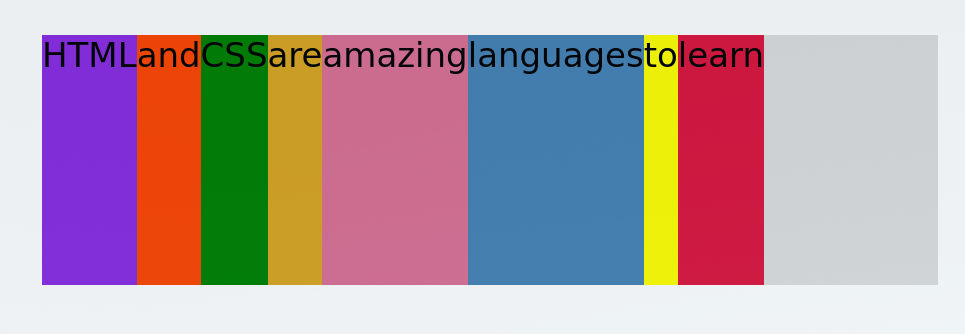

# HTML and CSS Notes

## HTML tags

| tag                              | description                      |
| -------------------------------- | -------------------------------- |
| `<doctype html>`                 | Information                      |
| `<html>`                         |                                  |
| `<head>`                         |                                  |
| `<body>`                         |                                  |
| `<title>`                        |                                  |
| `<header>`                       |                                  |
| `<h1>`                           |                                  |
| `<h2>`                           |                                  |
| `<h3>`                           |                                  |
| `<h4>`                           |                                  |
| `<h5>`                           |                                  |
| `<h6>`                           |                                  |
| `<nav>`                          |                                  |
| `<a href="mypage.html">link</a>` |                                  |
| `<article>`                      |                                  |
| ``         |                                  |
| `<p>`                            |                                  |
| `<strong>`                       |                                  |
| `<b>`                            |                                  |
| `<em>`                           |                                  |
| `<ol>`                           | numbered list                    |
| `<ul>`                           | bullet list                      |
| `<li>`                           | bullet (inside `<ul>` or `<ol>`) |
| `<footer>`                       |                                  |
| `<aside>`                        |                                  |
| `<button>`                       |                                  |
| `<style>`                        | css                              |
| `footer`                         |                                  |

## CSS tags

| tag                          | description                                    |
| ---------------------------- | ---------------------------------------------- |
| `font-size`                  | size of font e.g. 20px                         |
| `font-family`                | font e.g. `sans-serif`                         |
| `text-transform`             | lowercase, uppercase etc.                      |
| `font-style`                 | italic, bold, etc                              |
| `text-align`                 | left, center, right, etc                       |
| `line-height`                | spacing between lines e.g for `<p>`            |
| `list-style`                 | square, circle, number                         |
| `background-color`           | background color for area                      |
| `border`                     | border                                         |
| `border-top`                 | top border                                     |
| `border-bottom`              | bottom border                                  |
| `border: 5px solid black`    | 5px solid black border                         |
| `* {}`                       | whole document                                 |
| `body {}`                    | whole body tag                                 |
| `margin`                     | sets margin area on all four sides of element  |
| `margin: 1px 2px`            | vertical-horizontal margin                     |
| `margin: 1px 2px 3px`        | top-horizontal-bottom margin                   |
| `margin: 1px 2px 3px 4px`    | top-right-botton-left margin                   |
| `margin-bottom: 1px`         | botton margin                                  |
| `margin-left: 1px`           | left margin                                    |
| `margin-top: 1px`            | top margin                                     |
| `margin-right: 1px`          | right margin                                   |
| `text-align:`                | alignement of text                             |
| `text-transform:`            | e.g. `uppercase` or `lowercase`                |
| `padding:`                   | sets padding area - four sides of element      |
| `font-weight:`               | e.g. `bold`                                    |
| `text-decoration`            | e.g. `underline`, `none`. used with links      |
| `cursor:`                    | sets the mouse cursor at hoover                |
| `<a hre... class="x">x</a>`  | please see below - css and links               |
| `.x:hover {}`                | style at hoover in class `x`                   |
| `.x:active {}`               | style at link click                            |
| `.x:link {}`                 | link style                                     |
| `.x:visited {}`              | link style when visited                        |
| `<ul class="list">`          | see blow for styling                           |
| `.list{list-style: square;}` | squared bullets in list                        |
| `.list li {}`                | styling of each bullet e.g. `margin-left:`     |
| `if <p id="test">`           | use then `#test {}`                            |
| `if <p>`                     | use then `p {}`                                |
| `if <p class="test">`        | use then `.test{}`                             |
| `position:`                  | e.g. `absolute`, `relative`                    |
| `.x{position: relative}`     | offset relative to itself (see: pos below)     |
| `.x{position: absolute}`     | remove from normal flow of doc (pos below)     |
| `width`                      | sets an elements width                         |
| `li:first-child {}`          | first bullet                                   |
| `li:last-child {}`           | last bullet                                    |
| `li:nth-child(even)`         | even numbered bullets                          |
| `display:`                   | e.g. `inline`,`inline-block`,`block` see displ |
| `a:link {}`                  | style for links in `<a>` tags                  |
| `a:hover {}`                 | style for links in `<a>` when hoovered         |
| `a:active {}`                | style for links in `<a>` when clicked          |
| `nav a:link {}`              | style for links in `<a>` which in a `<nav>`    |
| `nav a:link:last-child {}`   | last link in `<a>` -> `<navb>`                 |
| `button {}`                  | design for a `<button>` tag.                   |
| `h3 + p {}`                  | style `<p>` directly after `h3` (see: op)      |
| `h3 + p::first-line {}`      | style first line of the paragraph after `<h3>` |
| `h1::first-letter {}`        | style the first letter in `<h1>`               |
| `element::after {}`          | see ::after and ::before                       |
| `element::before {}`         | see `::after` and `::before`                   |
| `float:`                     | let the element float e.g. `float: left;`      |
| `clear:`                     | clear the float                                |
| `clear: both`                | Clears float on both sides                     |
| `box-sizing:`                | e.g. `border-box` or `content-box`             |

## What is CSS?

CSS stands for Cascading Style Sheets

## How can CSS be sources into a HTML document?

You can insert CSS code inside a HTML document in three different ways i.e.
`Inline CSS`, `Internal CSS` and `External CSS`.

### Inline CSS

`Inline CSS` means writing CSS code inside an HTML element brackets
e.g. `<h1 style="color: blue">This text is blue</h1>`. This is not recommended.

### Internal CSS

`Internal CSS` means writing CSS code inside `<style>` brackets in the HTML
document itself. The `<style>` tags needs to be in the `<header>` section i.e.

```html
<html>
  <head>
    <title>title</title>
    <style>
      h1 {
        color: blue;
      }
    </style>
  </head>
  <body>
    <h1>This text is blue</h1>
  </body>
</html>
```

### External CSS

`External CSS` means creating a external CSS file, typically named `style.css`.
This file is then sourced into the HTML code through placing following code
inside the header brackets `<link href="style.css" rel="stylesheet" />` in the HTML file.

Example of `style.css`:

```css
h1 {
  color: blue;
}
```

Sourcing this file into a HTML document will make all the text between `<h1>`
brackets blue.

## Classes and id-selectors

Comment in css: `/* comment */`

Comment in vs-code: `<c-/>`:

Working with id's in CSS:

- specify id in a html tag like `<p id="copyright>` or `<p id="author">` and
  then use `#author {}` and `#copyright{}` in the css file for styling. make sure
  that there can only be 1 id in the html file. if you want to use the styling in
  several different places you need to use classes. these are specified in the
  same way i.e. `<p class="related-author">` and then `.related-author{}` in the
  css file.

Disable bullet points: `ul {list-style = none;}`

You should use classes and not id's.

Color can be specified as `rgb(x,y,z)` or `#hexvalue`. `rgba()` also specifies
transparency.

Selectors are additive.

You can basically give an area a name i.e. `<header>`and then only choose to
style it with `header {background-color: black;}` if you have similar areas of
`<header>`, you can basically add a class to it.

If you want to add a background color to whole document,
just add `body {background-color: blue;}`

Two methods set the first bullet list to another style than the rest of them:

1. set class "first-li" to all first `<li>` tags in a list i.e. `<li class="first-li">`
2. without modifying the html code, you can write following code in the `css`
   file `li:first-child {font-weight: bold;}` this is called pseudo-classes.

### Pseudo-classes

Examples of pseudo classes

```css
/* first list element */
li:first-child {
  font-weight: bold;
}

/* last list element */
li:last-child {
  font-style: italic;
}

/* second list element */
li:nth-child(2) {
  color: red;
}

/* all odd list elements */
li:nth-child(odd) {
  color: black;
}
```

Another example that will not work which is a common missconseption on how
pseudo classes works. For example, if we have this html code:

```html
<article>
  <header>
    <h2>the basic language of the web: html</h2>

    

    <p id="author">
      posted by <strong>laura jones</strong> on monday, june 21st 2027
    </p>
  </header>
</article>
```

and we are using the following `css` code:

`article p:first-child {color:red}` will not work since `<p>` is not the first
child of `<article>`, it is header which is the first child of `<article>` will
not work since `<p>` is not the first child of `<article>`, it is header which
is the first child of `<article>`. so what would work in this case is only
`artcile header { color:purple;}`.

in the following html code we see that `<p>` is the last child of `<article>`,
here we could use: `article p:last-child { color: red;}` to style that.

Style first letter in `<h1>` directly from css:

```css
h1::first-letter {
  font-style: normal;
  margin-right: 10px;
}
```

Style first line in all `<p>` tags:

```css
p::first-line {
  color: red;
}
```

Style the first line in a paragraph directly after a `<h3>` tag:

```css
h3 + p::first-line {
  color: darkorchid;
}
```

Add a cool "top box" next to a `<h2>` header:

```css
h2 {
position:relative;
}
h2::after {
content: "top";
background-color: yellow;
color:black;
font-size: 16px;
font-weight: bold;
display: inline-block;
padding: 5px 10px;
position: absolute;
top:-15px;
right: -25px;
```

## Inheritance

If you style `<p>`, all the tags within the `<p>` tag will follow. i.e. if you
have `<p>hey <strong>you</strong></p>` and you style `<p>`, then `<strong>`
will inherit the style.

Inheritance comes from parent tags. E.g. style `a (link)` and `p` tags within
`a` `<nav>` tag:

`nav a:link, nav p { font-size: 18px; }`

Or you could just do: `nav { font-size: 18px;}` which basically is the same if
there is only a `<a>` and `<p>` tag inside the `<nav>`.

Universal selector: `* {}`, you could also use `body {}`.

## Combining selectors

You can use the same properties for many selectors at the same time e.g.,

```css
h1,
h2,
h3,
h4,
li,
p {
  font-family: sans-serif;
}
```

Modify `<p>` tags only in the `<footer>` - use then:

```css
footer p {
  font-size: 10px;
}
```

Same for `<p>` tags in headers - use then

```css
header p {
  font-style: italic;
}
```

following code formats `<p>` tags which is inside a `<header>` tag which itself
is in a `<article>` tag.

## Conflicts between selectors

1. Should not be used: declaration marked `!important`.
2. Should not be used: inline style (style attribute in html)
3. Highest priority: id selector (last selector gets applied)
4. Class (.) or pseudo class (:) selector
5. Element selector (p, div, li, etc)
6. Universal selector

## Styling hyperlinks

```css
/* styling hyperlinks */
a:link {
  color: #1098ad;
  text-decoration: none; /* no underline on links */
}

a:visited {
  color: #1098ad; /* same color on links*/
}

a:hover {
  color: orange;
  font-weight: bold;
  text-decoration: underline dotted orangered;
}

a:active {
  background-color: black;
  font-style: italic;
}
```

## Images

Set the width or height to what is specified in the html tag, use:

`.post-img { width: 100%; height: auto;}`

The `width: 100%` is making the width of the pciture dynamic.

## Centering

Add container of what you want to center line `<div class="container">`. Add
following in the css
`.container {width: 700px}; margin-left: auto; margin-right: auto;}`
this centers the page and is dynamic.

One usual mistake that people do is that they try to center e.g. text inside
inline elements. For example, you have:

```html
<nav>
  <a href="blog.html">blog</a>
  <a href="#">challenges</a>
  <a href="#">flexbox</a>
  <a href="#">css grid</a>
</nav>
```

and then you want to center the links with:

```css
nav a:link {
  text-align: center;
}
```

This will not work since inline elements dont have any space over for what it
contains.

The solution is that you should place the `text-align:center;` property to its
parent.

The solution is that you should place the `text-align:center;` property to its
parent i.e.

```css
nav {
  text-align: center;
}
```

## Position

### Relative

The element is positioned according to the normal flow of the document, and then
offset relative to itself based on the values of top, right, bottom, and left.
The offset does not affect the position of any other elements; thus, the space
given for the element in the page layout is the same as if position were static.

### Absolute

The element is removed from the normal document flow, and no space is created
for the element in the page layout. It is positioned relative to its closest
positioned ancestor, if any; otherwise, it is placed relative to the initial
containing block. Its final position is determined by the values of top,
right, bottom, and left.

### Static

The element is positioned according to the normal flow of the document. the top,
right, bottom, left, and z-index properties have no effect. This is the default
value.

### More

If you want to add a **like button** in the button of the page (right). you can
first add a `<button>` tag in the html code then in the css code you can
specify: `button { position: absolute; bottom: 50px; right: 50px;}` and then in
the body you can add `body {position:relative;}`. you can also put the
`relative` position in a container.

Should only be used for single elements.

## Display

The display CSS property sets whether an element is treated as a block or inline
element and the layout used for its children, such as flow layout, grid or flex.

Formally, the display property sets an element's inner and outer display types.
The outer type sets an element's participation in flow layout; the inner type
sets the layout of children. Some values of display are fully defined in their
own individual specifications; for example the detail of what happens when
display: flex is declared is defined in the CSS flexible box model specification

### Block

The element generates a block element box, generating line breaks both before
and after the element when in the normal flow.

### Inline

The element generates one or more inline element boxes that do not generate line
breaks before or after themselves. in normal flow, the next element will be on
the same line if there is space.

### Inline-block

The element generates a block element box that will be flowed with surrounding
content as if it were a single inline box (behaving much like a replaced element
would).

### More

- inline boxes: dont create any vertical space outside the element i.e. the
  margin: i.e. `nav a: link {margin: 20px; }` wont work since it does not create
  any vertical space. the padding will indeed work since it is inside the box
  i.e. `nav a:link {padding: 20px;}`. to change it to an block level element
  with `nav a:link {margin:20px; padding:20px; display: block;}`. this will get
  the `margin` to work..

- block level elements:

- inline block element: combination of inline element and box elements
  e.g. `nav a: link {margin-top:30px; display:inline-block;}`

- images are inline-block elements.

## Float

E.g. `float: none`, `float: left;` or `float:right`.

The float css property places an element on the left or right side of its
container, allowing text and inline elements to wrap around it. the element is
removed from the normal flow of the page, though still remaining a part of the
flow (in contrast to absolute positioning).

Example of `float:right`:


## Sizing notation

Following codes are equal:

```css
.main-header {
  padding: 20px;
  padding-left: 40px;
  padding-right: 40px;
}
```

```css
.main-header {
  padding: 20px 40px;
}
```

## Layouts

Three types of layouts:

1. floats
2. flexbox
3. grid

## Float

If a container, header, or whatsoever contains child elements which all are
floated, then the height of the container will collapse. you can clear floats
by adding a `<div class="clear"></div>` element into the container and in the
css code state: `.clear {clear: both};`.

you could also add a class called `clearfix` to the parent element and then add
a new last child element
with `.clearfix::after { clear: both; content:''; display: block}`

If the contents don't fit in a flow dynamic based on the components weights, you
can use the `box-sizing: border-box;`. if you want this box model be applied
to all elements on the page, just put it in the universal selector `* {}`. you
cannot put it in the body section since `box-sizing:` doesnt get inherited.

## Flexbox

Following code gives:

```html
<!DOCTYPE html>
<html lang="en">
  <head>
    <meta charset="utf-8" />
    <meta http-equiv="x-ua-compatible" content="ie=edge" />
    <meta name="viewport" content="width=device-width, initial-scale=1.0" />
    <title>flexbox</title>
    <style>
      .el--1 {
        background-color: blueviolet;
      }
      .el--2 {
        background-color: orangered;
      }
      .el--3 {
        background-color: green;
        height: 250px;
      }
      .el--4 {
        background-color: goldenrod;
      }
      .el--5 {
        background-color: palevioletred;
      }
      .el--6 {
        background-color: steelblue;
      }
      .el--7 {
        background-color: yellow;
      }
      .el--8 {
        background-color: crimson;
      }

      .container {
        /* starter */
        font-family: sans-serif;
        background-color: #ddd;
        font-size: 34px;
        margin: 40px;
      }
    </style>
  </head>
  <body>
    <div class="container">
      <div class="el el--1">html</div>
      <div class="el el--2">and</div>
      <div class="el el--3">css</div>
      <div class="el el--4">are</div>
      <div class="el el--5">amazing</div>
      <div class="el el--6">languages</div>
      <div class="el el--7">to</div>
      <div class="el el--8">learn</div>
    </div>
  </body>
</html>
```

Following output:


Please note that all child elements of the `<div class="container">` will be
affected of the `flex` configuration.

#### Configuring flexbox

##### Base configuration

Adding:

```css
.container {
  display: flex;
}
```

Activates flexbox. This gives the output:


Please note that:

- the grey color is the background color of the container (the empty part of the
  container).
- horizontally, each element takes up the exactly space to fit its content.
- vertically, all the elements takes the size of the tallest element. in this
  case the `css` box which has a height of 250 px.

##### `align-items: center`

Adding:

```css
.container {
  display: flex;
  align-items: center;
}
```

You will basically align all the boxes at the center of the container. elements
will be at their true height. please see below:


##### `align-items: flex-start`

```css
.container {
  display: flex;
  align-items: flex-start;
}
```

Aligns all the boxes at the start of the container. Elements will be at their
true height. Please see below:


##### `align-items: flex-end`

```css
.container {
  display: flex;
  align-items: flex-end;
}
```

Aligns all the boxes at the end of the container. Elements will be at their true
height. Please see below:


##### `align-items: stretch`

```css
.container {
  display: flex;
  align-items: stretch;
}
```

stretches the boxes to match the height of the tallest element in the container.
the width will be exactly so that it fits its content of each box.



##### `justify-content: center`

Centers the elements in the container in the middle

```css
.container {
  display: flex;
  justify-content: center;
}
```

Please see image below:


##### `justify-content: space-between`

Sets equal space among the elements to match the horizontal size of container.

```css
.container {
  display: flex;
  justify-content: space-between;
}
```

Please see image below:


### Spacing and aligning flex items

`align-items:` vertical alignment
`justify-content:` horizontal alignment

Using following css code for the container:

```css
.container {
  /* starter */
  font-family: sans-serif;
  background-color: #ddd;
  font-size: 34px;
  margin: 40px;
  display: flex;
  align-items: center;
  justify-content: flex-start;
}
```

this means that all elements are aligned like following:


#### Overriding `align-items:` for elements with `align-self:`

you can override this for several or one element with the `align-self:` attribute.

Example 1:

```css
.el--1 {
  align-self: flex-start;
}
```

Will give you:


Example 2:

```css
.el--5 {
  align-self: stretch;
}
```

Will give you the following output:


#### Rearranging individual elements with `order:`

Example 1:

```css
.el--6 {
  order: -1;
}
```

Which will give you:


Example 2:

```css
.el--5 {
  order: 1;
}
```

Will give you:


#### Adding space between items with `gap:`

Example:

```css
.container {
  font-family: sans-serif;
  background-color: #ddd;
  font-size: 34px;
  margin: 40px;
  display: flex;
  align-items: center;
  justify-content: flex-start;
  /* gap: 30px; */
}
```

Given gap between the elements of 30px:


### the `flex` property

The default property of flex is:

```css
.el {
  flex-grow: 0;
  flex-shrink: 1;
  flex-basis: auto;
}
```

#### `with` of elements with flex

With `flex`, you should not use the `width:` property, you should instead use `flex-basis:`.

Example:

```css
.el {
  flex-basis: 100px;
}
```

This will give following output:


#### `flex-shrink:` property

Please note that with `flex-basis:`, normally, the width of the elements will
extend to 100px. but if them content in the element has larger size than
specified, e.g. 100px as in the prior example, the `flex-basis:` proprty will
extend 100px until it fits its contents. this is actually a feature of the
`flex-grow:` property.

Another note is that if you give the elements a really big size, lets say for
example 200px. the elements will extend to so its fits its container, not more.
so the ultime width of its element will be smaller if 200px is to large. the
browsert will calibrate the width so the elements exactly fits its container.
this feature is coming from the default value of `flex-shrink:1`.

so, as an example:

```css
.el {
  /* default flex portperties */
  /* flex-grow: 0;
  flex-shrink: 1;
  flex-basis: auto; */

  flex-basis: 200px;
}
```

Will give the following output:


If we now edit the default property of `flex-shrink:1` to `flex-shrink: 0`. this
gives:

```css
.el {
  /* default flex portperties */
  /* flex-grow: 0;*/
  flex-shrink: 0;
  /* flex-basis: auto; */

  flex-basis: 200px;
}
```

this gives the output:


This basically forces every element to 200px even if it extends beyond the container.

#### `flex-grow:` property

The following code:

```css
.el {
  flex-shrink: 0;
}
```

Gives:


But extending the code with,

```css
.el {
  flex-shrink: 0;
  flex-grow: 1;
}
```

gives the output:


The `flex-grow:1` property divides the maxiumum space in the container evenly
among the elements inside the container.

If you set the `flex-grow:1` property for an individual element, the other
elements will fill up its content and the element that has the property
`flex-grow:1` will fill up the rest of the empty space isnide the container.

```css
.el--1 {
  flex-grow: 1;
}
```

Gives:


The value of `flex-grow:` is also relative to the rest of the elements. for
example, if we in the container have `.el {flex-grow:1}` and in a single element
have `.el--1 { flex-grow:2}`. this means that the element 1 will have 2 times
the size of the available space as compared to the rest of the elements.

#### The `flex:` property

`flex:` property is a short for `flex-grow:`, `flex-shrink:` and `flex-basis:`.
so for example, `flex: 0 0 200px;` actually means:

```css
.el {
  flex-grow: 0;
  flex-shrink: 0;
  flex-basis: 200px;
}
```

you should always use `flex:` and not the other three ones.

## flex grid

```css
.container{
  display: grid;
  grid_template-columns: 250px 150px /* two columns, one 250px wide and one 150px wide */
  grid-template-rows: 300px 200px; /* two rows, first row 300px and second 200px */
  gap: 30px; /* creates between the items in the grid */
  /* you can also use following */
  column-gap: 30px; /* creates a gap between the column */
  row-gap:60px; /* creates a gap between the rows */
}
```

when you need a one dimensional layout: use flexbox
when you need a two dimensional layout: use flex grid

Create a grid container by setting `display: grid` to an container. the the
items / containers in this container becomes the grid items.

grid-lines surrounds the grid cells.

Gutters is a css word for gaps.

Grid track is basically a row or column.

```css
display: grid;
grid-tempplate-columns: 200px 200px 1fr 100px; /* 1fr fills the rest of the empty space */
```

```css
display: grid;
grid-tempplate-columns: 200px 200px 1fr 1fr; /* both 3 and 4 column fill out the empty space */
```

```css
display: grid;
grid-tempplate-columns: 1fr 1fr 1fr 1fr; /* all columns fill out thte empty spacew */
```

```css
display: grid;
grid-tempplate-columns: 1fr 2fr 3fr 4fr; /* relative sizong */
```

```css
display:grid;
grid-tempplate-columns: 1fr 1fr 1fr auto; /* 4th column fills out the empty space.
```

```css
display: grid;
grid-tempplate-columns: repeat(4, 1fr); /* short for 1fr 1fr 1fr 1fr */
```

all the same as above implies for rows.

### Placing and spanning grid items

```css
.el--8 {
  grid-column: 2 / 3; /* grid item should start at the beginning of column nr 2 and end at column 3 */
  grid-row: 1 / 2;
}

.el--2 {
  grid-column: 1; /* also possible */
  grid-row: 2; /* also possible */
}

.el--4 {
  grid-column: 1 / 3; /* spans over three columns */
  grid-row: 2; /* also possible */
}

.el--4 {
  grid-column: 1 / span 4; /* another syntax - same as above */
  grid-row: 2;
}

.el--4 {
  grid-column: 1 / -1; /* from the first column to the last column */
  grid-row: 2;
}
```

Spanning works exactly the same with rows i.e. `grid-row`.

### Aligning grid items

```css
/* CSS GRID */
display: grid;
grid-template-column: 125px 200px 125px;
grid-template-rows: 250px 100px;
gap: 50;

/* Aligning tracks inside container:
distribte empty spaces:*/

justify-content: center;

/* justify-content: flex-between; */

align-content: center;
/* align-content:  flex-between; */
/* align-content: end; //Like flex-end in flex-box */
/* align-content: start; //Like flex-start in flex-box */

/* Align items inside cells: moving items around inside cells */
aling-items: center;
justify-items: center;

/* Overriding settings in the main container */
.el--3 {
  align-selg: end;
  justify-self: end;
}
```


The keyword `display: none` basically removes the container.

### Building a simple CSS grid layouts

/_CSS GRID_/
display: grid;
grid-template-columns: 125px 200px 125px;
grid-template-rows: 250px 100px;
gap: 50px;

/_Aligning tracks inside container horizontally_/
justify-content: center;

/_Aligning tracks inside container vertically_/
align-content: center;

/_Aligning items inside cells: moving items around inside cells_/

/_horizontally_/
justify-items: center;

/_verically_/
align-items: center;
/_Overide_/
/_horizontally_/
justify-self: end;

/_vertically_/
align-self: end;

grid-column: 1/2;
/\*

- With _span_, you can span the box over several rows / columns
- If you write grid-column: 1 / -1 it basically indicates that the box
- should span from column 1 to the last column
  \*/
  grid-row: 1 / span 3;

grid-column: 1 / -1;

## + operator

The `+` sign selector is used to select the elements that are placed immediately
after the specified element but not inside the particular elements.

## `::after` and `::before`

Example:


Example:


## Section 5: Web design rules and Framework

## Project overview

span
blockquote
em

## Overview of web designs and website personalities

Design Software:
Fketch
Sigma
Photoshop Xd
Photoshop Ps

## Web Design Rules #1: Typography

## Implementing typography

Link font file before css file.

Please note that you can adjust css variables in realtime in the inspect window.

letter-spacing: -1px;
line-height: 1.7;

Use a font size system.

## Web dsegin rules: #2: Colors

Toolbox:
<https://yeun.github.io/open-color/#gray>
Taiwindcss
Flat UI Colors

Check colors with coolors contrast checkers.

Use <figure> for cards

Steal designs:
Lands-book.com
One page love
awwards

You can have flex inside <ul> <li>.
